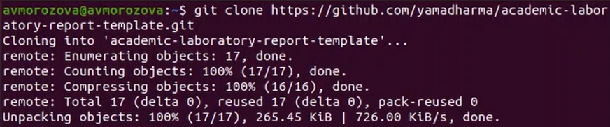
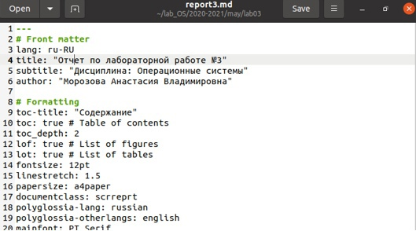
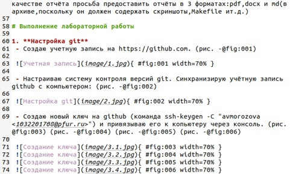
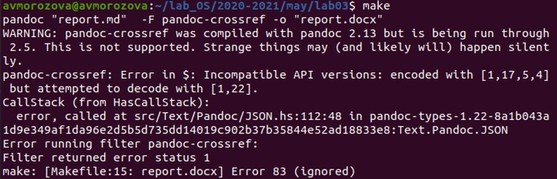
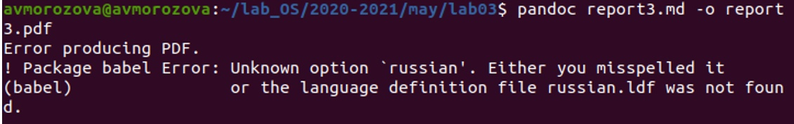
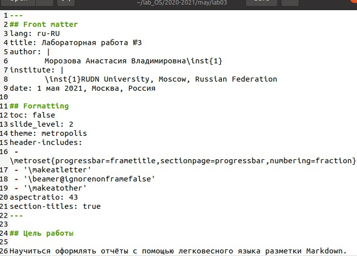

---
## Front matter
lang: ru-RU
title: Лабораторная работа №3
author: |
	Морозова Анастасия Владимировна\inst{1}
institute: |
	\inst{1}RUDN University, Moscow, Russian Federation
date: 1 мая 2021, Москва, Россия

## Formatting
toc: false
slide_level: 2
theme: metropolis
header-includes: 
 - \metroset{progressbar=frametitle,sectionpage=progressbar,numbering=fraction}
 - '\makeatletter'
 - '\beamer@ignorenonframefalse'
 - '\makeatother'
aspectratio: 43
section-titles: true
---

## Цель работы

Научиться оформлять отчёты с помощью легковесного языка разметки Markdown.

## Задание

1. Сделайте отчёт по предыдущей лабораторной работе в формате Markdown.
2. В качестве отчёта предоставить отчёты в 3 форматах: pdf, docx и md (в архиве, поскольку он должен содержать скриншоты, Makefile и т.д.)

## Ход работы

Скачала необходимые для работы шаблоны отчета с github. (рис. -@fig:001)

{ #fig:001 width=70% }

## Ход работы

По шаблону оформила отчет по лабораторной работе №2 в Markdown  (рис. -@fig:002)

{ #fig:002 width=70% }

## Ход работы

Оформление отчета (рис. -@fig:003)

{ #fig:003 width=70% }

## Ход работы

Далее было необходимо обработать файлы в формате pdf и docx с помощью pandoc. Но возникли сложности при подгрузке pandoc, и это сделать не удалось (рис. -@fig:004)

{ #fig:004 width=70% }

## Ход работы

(рис. -@fig:005)

{ #fig:005 width=70% }

## Ход работы

По аналогии скачала шаблон для презентации и оформила презентацию в Markdown (рис. -@fig:006)

{ #fig:006 width=70% }

## Ход работы

Загрузила на github имеющиеся файлы. (рис. -@fig:007)

{ #fig:007 width=70% }

## Вывод

В ходе данной лабораторной работы я научилась оформлять отчёты с помощью легковесного языка разметки Markdown.

