---
# Front matter
lang: ru-RU
title: "Отчет по лабораторной работе №3"
subtitle: "Дисциплина: Операционные системы"
author: "Морозова Анастасия Владимировна"

# Formatting
toc-title: "Содержание"
toc: true # Table of contents
toc_depth: 2
lof: true # List of figures
lot: true # List of tables
fontsize: 12pt
linestretch: 1.5
papersize: a4paper
documentclass: scrreprt
polyglossia-lang: russian
polyglossia-otherlangs: english
mainfont: PT Serif
romanfont: PT Serif
sansfont: PT Sans
monofont: PT Mono
mainfontoptions: Ligatures=TeX
romanfontoptions: Ligatures=TeX
sansfontoptions: Ligatures=TeX,Scale=MatchLowercase
monofontoptions: Scale=MatchLowercase
indent: true
pdf-engine: lualatex
header-includes:
  - \linepenalty=10 # the penalty added to the badness of each line within a paragraph (no associated penalty node) Increasing the value makes tex try to have fewer lines in the paragraph.
  - \interlinepenalty=0 # value of the penalty (node) added after each line of a paragraph.
  - \hyphenpenalty=50 # the penalty for line breaking at an automatically inserted hyphen
  - \exhyphenpenalty=50 # the penalty for line breaking at an explicit hyphen
  - \binoppenalty=700 # the penalty for breaking a line at a binary operator
  - \relpenalty=500 # the penalty for breaking a line at a relation
  - \clubpenalty=150 # extra penalty for breaking after first line of a paragraph
  - \widowpenalty=150 # extra penalty for breaking before last line of a paragraph
  - \displaywidowpenalty=50 # extra penalty for breaking before last line before a display math
  - \brokenpenalty=100 # extra penalty for page breaking after a hyphenated line
  - \predisplaypenalty=10000 # penalty for breaking before a display
  - \postdisplaypenalty=0 # penalty for breaking after a display
  - \floatingpenalty = 20000 # penalty for splitting an insertion (can only be split footnote in standard LaTeX)
  - \raggedbottom # or \flushbottom
  - \usepackage{float} # keep figures where there are in the text
  - \floatplacement{figure}{H} # keep figures where there are in the text
---

# Цель работы

Изучить идеологию и применение средств контроля версий

# Задание

Сделать отчёт по предыдущей лабораторной работе в формате Markdown.В качестве отчёта просьба предоставить отчёты в 3 форматах:pdf,docx и md(в архиве,поскольку он должен содержать скриншоты,Makefile ит.д.)

# Выполнение лабораторной работы

1. **Настройка git**
 - Создаю учетную запись на https://github.com. (рис. -@fig:001)

 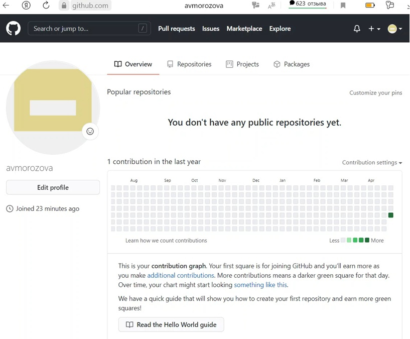{ #fig:001 width=70% }
 
 - Настраиваю систему контроля версий git. Синхранизирую учётную запись github с компьютером: (рис. -@fig:002)

 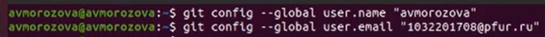{ #fig:002 width=70% }
 
 - Создаю новый ключ на github (команда ssh-keygen -C "avmorozova <1032201708@pfur.ru>") и привязываю его к копьютеру через консоль. (рис. -@fig:003) (рис. -@fig:004) (рис. -@fig:005) (рис. -@fig:006)
 
 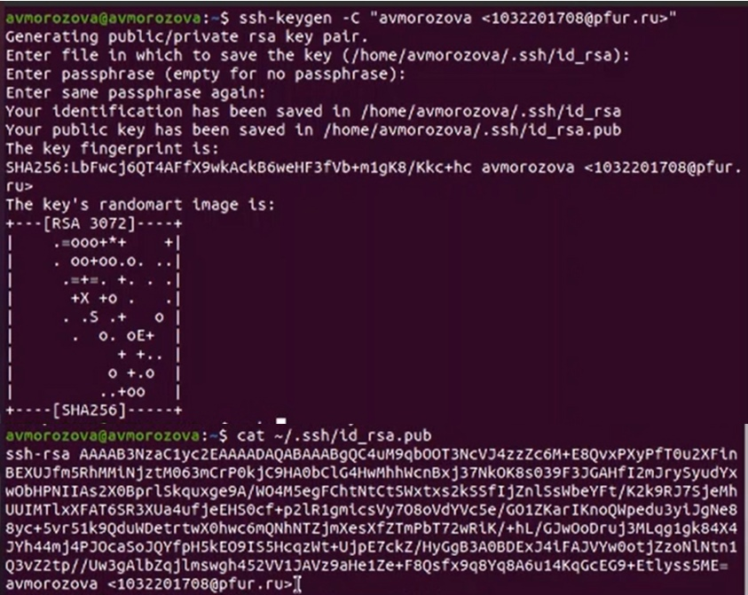{ #fig:003 width=70% }
 { #fig:004 width=70% }
 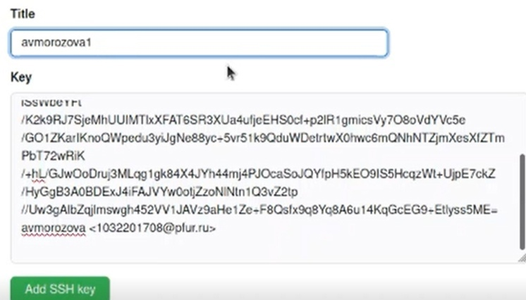{ #fig:005 width=70% }
 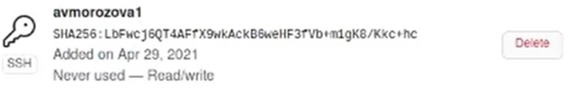{ #fig:006 width=70% }

2. **Подключение репозитория к github**
 - В githup захожу в «repositories» и создаю новый репозиторий (имя «lab_OS», заголовок для файла README). Копируем в консоль ссылку на репозиторий. (рис. -@fig:007)

 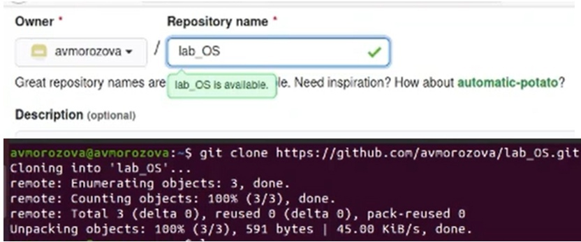{ #fig:007 width=70% }
 
 - Работаю с каталогом и папками через консоль. Перед тем, как создавать файлы, захожу в репозиорий: (рис. -@fig:008)

 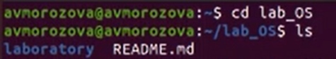{ #fig:008 width=70% }
 
 - Создаю файлы: (рис. -@fig:009)

 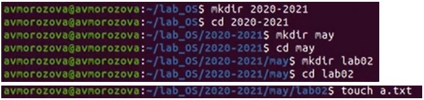{ #fig:009 width=70% }
 
 - Добавляю первый коммит и выкладываю на githup. Для того, чтобы правильно разместить первый коммит, необходимо добавить команду git add . , далее с помощью команды git commit -m "first commit" выкладываем коммит: (рис. -@fig:010)

 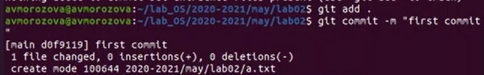{ #fig:010 width=70% }
 
 - Сохраняю первый коммит (git push): (рис. -@fig:011)

 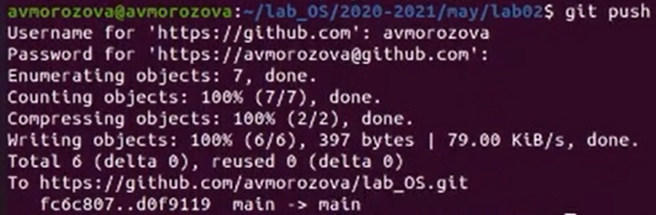{ #fig:011 width=70% }
 
3. **Первичная конфигурация**
 - Добавляю файл лицензии: (рис. -@fig:012)

 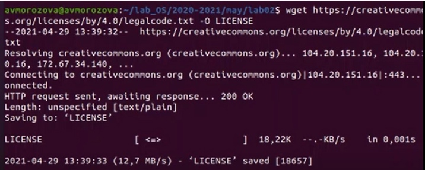{ #fig:012 width=70% }
 
 - Добавляю шаблон игнорируемых файлов. Получаю список имеющихся шаблонов (на скрине представлены не все шаблоны): (рис. -@fig:013)

 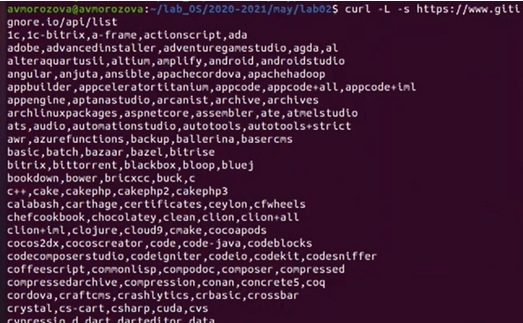{ #fig:013 width=70% }
 
 - Скачиваю шаблон, например, для C. Также добавляю новые файлы и выполняю коммит: (рис. -@fig:014)
 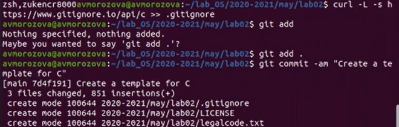{ #fig:014 width=70% }
 
 - Отправляю на github (git push): (рис. -@fig:015)
 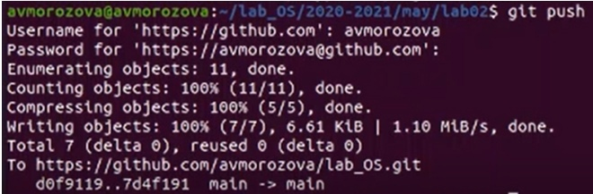{ #fig:015 width=70% }
 
4. **Конфигурация git-flow**

 - Инициализирую git-flow, используя команду git flow init -f (префикс для ярлыков установлен в v): (рис. -@fig:016)
 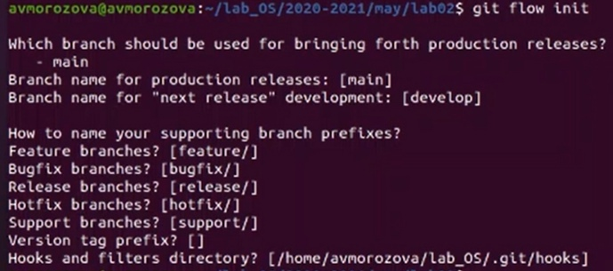{ #fig:016 width=70% }
 
 - Проверяю, что нахожусь на ветке develop (git branch): (рис. -@fig:017)
 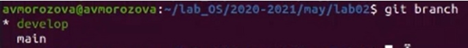{ #fig:017 width=70% }
 
 - Создаю релиз с версией 1.0.0: (рис. -@fig:018)
 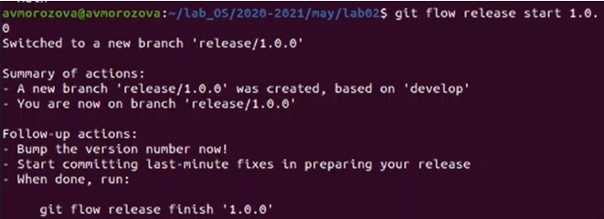{ #fig:018 width=70% }
 
 - Записываю версию и добавляю в индекс: (рис. -@fig:019)
 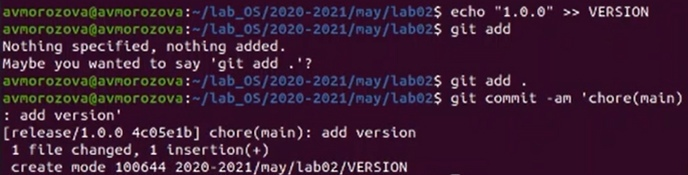{ #fig:019 width=70% } 
 
 - Заливаю релизную ветку в основную ветку: (рис. -@fig:020)
 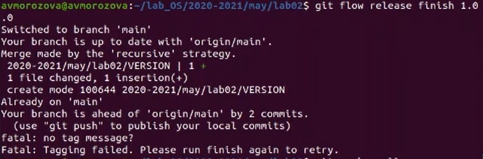{ #fig:020 width=70% }
 
 - Отправляю данные на github: (рис. -@fig:021)
 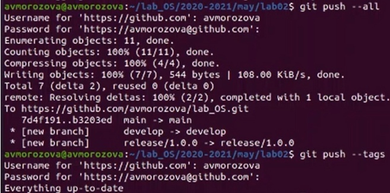{ #fig:021 width=70% }
 
 - Отправляю данные на github: (рис. -@fig:021)
 { #fig:021 width=70% }
 
 - Создаю релиз на github. Заходим в «Releases», нажимаю «Создать новый релиз». Захожу в теги и заполняю все поля (теги для версии 1.0.0). После создания тега, автоматически сформируется релиз. (рис. -@fig:022)
 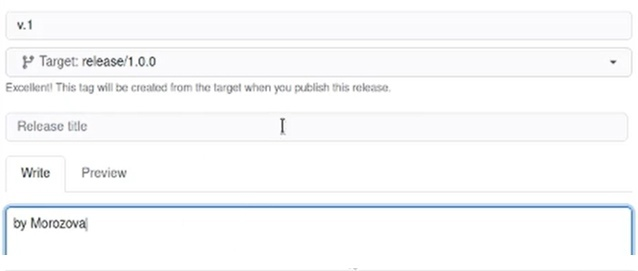{ #fig:022 width=70% }
 
 - Создаю релиз на github. Заходим в «Releases», нажимаю «Создать новый релиз». Захожу в теги и заполняю все поля (теги для версии 1.0.0). После создания тега, автоматически сформируется релиз. (рис. -@fig:022)(рис. -@fig:023)
 { #fig:022 width=70% }
 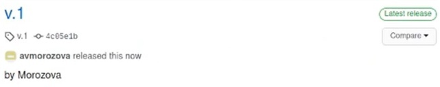{ #fig:023 width=70% }
 
# Выводы

В ходе выполнения лабораторной работы я научилась оформлять отчёты с помощью легковесного языка разметки Markdown.
