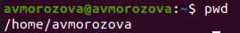
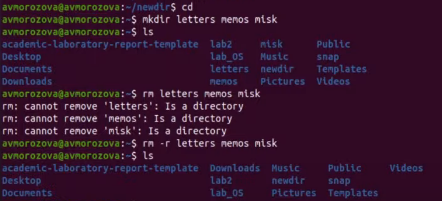
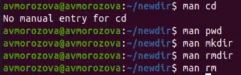
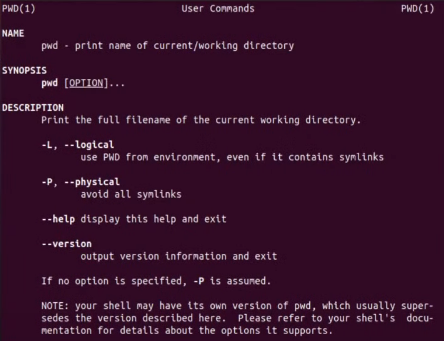
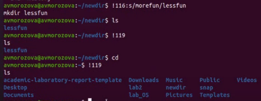

---
## Front matter
lang: ru-RU
title: Лабораторная работа №5
author: |
	Морозова Анастасия Владимировна\inst{1}
institute: |
	\inst{1}RUDN University, Moscow, Russian Federation
date: 13 мая 2021, Москва, Россия

## Formatting
toc: false
slide_level: 2
theme: metropolis
header-includes: 
 - \metroset{progressbar=frametitle,sectionpage=progressbar,numbering=fraction}
 - '\makeatletter'
 - '\beamer@ignorenonframefalse'
 - '\makeatother'
aspectratio: 43
section-titles: true
---

## Цель работы

Приобрести практические навыки взаимодействия пользователя с системой посредством командной строки

## Ход работы

Работала в консоли используя команды pwd, cd, ls с различными опциями (рис. -@fig:001)

{ #fig:001 width=70% }

## Ход работы

Так же при помощи команд создавала и удаляла каталоги, работала с ними  (рис. -@fig:002)

{ #fig:002 width=70% }

## Ход работы

Используя команды «man cd», «man pwd», «man mkdir», «man rmdir», «man rm», просматривала описание соответствующих команд (рис. -@fig:003)

{ #fig:003 width=70% }

## Ход работы
(рис. -@fig:004)

{ #fig:004 width=70% }

## Ход работы

С помощью команды history вывела историю команд и воспользовалась двумя из списка (рис. -@fig:006)

{ #fig:006 width=70% }

## Вывод

В ходе выполнения лабораторной работы я приобрела практические навыки взаимодействия пользователя с системой посредством командной строки

