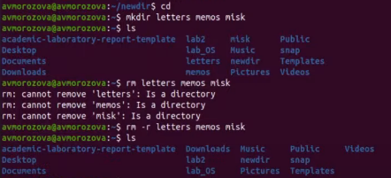

---
# Front matter
lang: ru-RU
title: "Отчет по лабораторной работе №5"
subtitle: "Дисциплина: Операционные системы"
author: "Морозова Анастасия Владимировна"

# Formatting
toc-title: "Содержание"
toc: true # Table of contents
toc_depth: 2
lof: true # List of figures
lot: true # List of tables
fontsize: 12pt
linestretch: 1.5
papersize: a4paper
documentclass: scrreprt
polyglossia-lang: russian
polyglossia-otherlangs: english
mainfont: PT Serif
romanfont: PT Serif
sansfont: PT Sans
monofont: PT Mono
mainfontoptions: Ligatures=TeX
romanfontoptions: Ligatures=TeX
sansfontoptions: Ligatures=TeX,Scale=MatchLowercase
monofontoptions: Scale=MatchLowercase
indent: true
pdf-engine: lualatex
header-includes:
  - \linepenalty=10 # the penalty added to the badness of each line within a paragraph (no associated penalty node) Increasing the value makes tex try to have fewer lines in the paragraph.
  - \interlinepenalty=0 # value of the penalty (node) added after each line of a paragraph.
  - \hyphenpenalty=50 # the penalty for line breaking at an automatically inserted hyphen
  - \exhyphenpenalty=50 # the penalty for line breaking at an explicit hyphen
  - \binoppenalty=700 # the penalty for breaking a line at a binary operator
  - \relpenalty=500 # the penalty for breaking a line at a relation
  - \clubpenalty=150 # extra penalty for breaking after first line of a paragraph
  - \widowpenalty=150 # extra penalty for breaking before last line of a paragraph
  - \displaywidowpenalty=50 # extra penalty for breaking before last line before a display math
  - \brokenpenalty=100 # extra penalty for page breaking after a hyphenated line
  - \predisplaypenalty=10000 # penalty for breaking before a display
  - \postdisplaypenalty=0 # penalty for breaking after a display
  - \floatingpenalty = 20000 # penalty for splitting an insertion (can only be split footnote in standard LaTeX)
  - \raggedbottom # or \flushbottom
  - \usepackage{float} # keep figures where there are in the text
  - \floatplacement{figure}{H} # keep figures where there are in the text
---

# Цель работы

Приобрести практические навыки взаимодействия пользователя с системой посредством командной строки

# Выполнение лабораторной работы

1. Определяю полное имя домашнего каталога, использую команду pwd. Т.к я уже нахожусь в домашней директории, переход в неё не осуществляю (рис. -@fig:001)

 { #fig:001 width=70% }
 
2. Выполняю следующие действия:

 - Перехожу в каталог /tmp (команда cd /tmp) (рис. -@fig:002)

 { #fig:002 width=70% }
 
 - Вывожу на экран содержимое каталога /tmp.
 
  Команды:
  - ls - выводится список каталогов и файлов, которые можно увидеть, открыв каталог tmp (рис. -@fig:003)
  
  - ls -a - выводится список каталогов и файлов, включая скрытые каталоги и файлы. Имена скрытый файлов начинаются с точки (рис. -@fig:004)
  
  - ls -F - получение информацию о типах файлов (каталог - /, исполняемый файл - *, ссылка - @) (рис. -@fig:005)
  
  - ls -l - получение более подробной информацией о каталогах и файлах (рис. -@fig:006)
  - ls -alF - список всех каталогов и файлов, в том числе и скрытых, с подробной информацией о них (рис. -@fig:007)
 
  { #fig:003 width=70% }
  
  { #fig:004 width=70% }
  
  { #fig:005 width=70% }
  
  { #fig:006 width=70% }
  
  { #fig:007 width=70% }

 - Чтобы определить, есть ли в каталоге /var/spool подкаталог с именем cron, перехожу в указанный каталог (команда cd /var/spool), просматриваю его (команда ls), убеждаюсь, что данный подкаталог существует (рис. -@fig:008)

 { #fig:008 width=70% }
 
 - Перехожу в домашний каталог (команда cd), вывожу на экран его содержимое (команда ls -alF). Владельцем всех каталогов и файлов, кроме родительского каталога (владелец - пользователь root из группы пользователей root ), является  пользователь avmorozova из группы пользователей avmorozova (рис. -@fig:009)

 { #fig:009 width=70% }
 
3. Выполняю следующие действия:

 - В домашнем каталоге создаю новый каталог newdir (команда mkdir newdir) (рис. -@fig:010)

 { #fig:010 width=70% }
 
 - Перехожу в ранее созданный каталог (команда cd newdir), создаю каталог morefun (команда mkdir morefun). (рис. -@fig:011)

 { #fig:011 width=70% }
 
 - Создаю в домашнем каталоге три новых (команда mkdir letters memos misk).Удаляю  созданные  каталоги (команда rm –r letters memos misk). Командой «ls» проверяем правильность выполненных действий (рис. -@fig:012)

 { #fig:012 width=70% }
 
 - Пробую удалить каталог newdir (команда rm newdir). Получаю отказ в  выполнении команды (т.к. каталог содержит подкаталог morefun и требуется при удалении использовать опцию -r). Далее удаляю каталог newdir/morefun (команда rm –r newdir/morefun). (рис. -@fig:013)

 { #fig:013 width=70% }
 
4. Определяю, какую опцию команды ls необходимо использовать, чтобы  просмотреть содержимое не только указанного каталога, но и подкаталогов, входящих в него (команда man ls). (рис. -@fig:014)
Опция -R (рис. -@fig:015)

 { #fig:014 width=70% }
 
 { #fig:015 width=70% }
 
5. Определяю набор опций команды ls, позволяющий отсортировать по времени  последнего изменения выводимый список содержимого каталога с развернутым описанием файлов (рис. -@fig:016)(рис. -@fig:017)(рис. -@fig:018)

 { #fig:016 width=70% }
 
 { #fig:017 width=70% }
 
 { #fig:018 width=70% }
 
6. Используя команды «man cd», «man pwd», «man mkdir», «man rmdir», «man rm», просматриваю описание соответствующих команд. Команда cd не имеет дополнительных опций. (рис. -@fig:019)

{ #fig:019 width=70% }

 - Команда pwd (рис. -@fig:020)
  - **-L, --logical** - не разыменовывать символические ссылки. Если путь содержит символические ссылки, то выводить их безпреобразования в исходный путь
  - **-P, --physical** - преобразовывать (отбрасывать символические    ссылки) символические ссылки в исходные имена. Если путь содержит символические ссылки, то они будут преобразованы в названия исходных директорий, на которые они указывают
  - **--help** - показать справку по команде pwd
  - **--version** - показать версию утилиты pwd
  
 { #fig:020 width=70% } 
 
 - Команда mkdir (рис. -@fig:021)
  - **-m, --mode=MODE** - устанавливает права доступа для создаваемой  директории. Синтаксис MODE такой же как у команды chmod
  - **-p, --parents** - создать все директории, которые указаны внутри  пути. Если какая-либо директория существует, то предупреждение об этом не выводится
  - **-v, --verbose** - выводить сообщение о каждой создаваемой директории
  - **-z** - установить контекст SELinux для создаваемой директории по умолчанию
  - **--context[=CTX]** - установить контекст SELinux  для  создаваемой  директории в значение CTX;
  - **--help** - показать справку по команде mkdir
  - **--version** - показать версию утилиты mkdir
  
 { #fig:021 width=70% }
 
 - Команда rmdir (рис. -@fig:022)
  - **--ignore-fail-on-non-empty** - игнорировать директории, которые содержат в себе файлы
  - **-p, --parents** - в  этой опции каждый аргумент каталога  обрабатывается как путь, из которого будут удалены все компоненты, если они уже пусты, начиная с последнего компонента
  - **-v, --verbose** - отображение    подробной    информациидля    каждого обрабатываемого каталога
  - **--help** - показать справку по команде rmdir
  - **--version** - показать версию утилиты rmdir
  
 { #fig:022 width=70% }
 
 - Команда rm  (рис. -@fig:023)
  - **-f, --force** - игнорировать несуществующие файлы и аргументы. Никогда не выдавать запросы на подтверждение удаления
  - **-i** - выводить запрос на подтверждение удаления каждого файла
  - **-I** - выдать один запрос на подтверждение удаления всех файлов, если  удаляется больше трех файлов или используется рекурсивное   удаление. Опция применяется, как более «щадящая» версия опции –i
  - **--interactive[=WHEN]** вместо WHEN можно использовать:
   - never — никогда не выдавать запросы на подтверждение удаления.
   - once — выводить запрос один раз (аналог опции -I)
   - always — выводить запрос всегда (аналог опции -i)
   Если значение КОГДА не задано, то используется always
  - **--one-file-system** - во время рекурсивного удаления пропускать  директории, которые находятся на других файловых системах
  - **--no-preserve-root** - если в качестве директории для удаления задан корневой раздел /, то читать, что это обычная директория и начать выполнять удаление
  - **--preserve-root[=all]** - если в качестве директории для удаления задан корневой раздел /, то запретить выполнять команду rm над корневым разделом. Данное поведение используется по умолчанию
  - **-r, -R, --recursive** - удаление директорий и их содержимого. Рекурсивное удаление
  - **-d, --dir** - удалять пустые директории
  - **-v, --verbose** - выводить информацию об удаляемых файлах
  - **--help** - показать справку по команде rm
  - **--version** - показать версию утилиты rm
  
 { #fig:023 width=70% }
 
7. Вывожу историю команд (команда history)(рис. -@fig:024). Выполняю команды 116 и 119 (команды !116:s/morefun/lessfun  и  !119) (в  116 будет создан каталог lessfun вместо morefun) (рис. -@fig:025)

 { #fig:024 width=70% }
 
 { #fig:025 width=70% }

8. Контрольные вопросы:
 - Командная строка – специальная программа, позволяющая управлять операционной системой при помощи текстовых команд, вводимых в окне приложения.
 - Для определения абсолютного пути к текущему каталогу используется команда  pwd  (print  working  directory).  Например,  команда  «pwd»  в моем домашнем каталоге выведет: /home/kaleontjeva
 - Команда  «ls-F» (или  «ls-aF»,  тогда  появятся  еще  скрытые  файлы) выведет имена файлов в текущем каталоге и их типы. Тип каталога обозначается /, тип исполняемого файла обозначается *, тип ссылки обозначается @.
 - Имена скрытых файлов начинаются с точки. Эти файлы в операционной системе скрыты от просмотра и обычно используются для настройки рабочей  среды. Для того, чтобы отобразить имена скрытых файлов, необходимо использовать команду «ls –a».
 - Команда rm  используется  для  удаления  файлов  и/или  каталогов. Команда rm-iвыдает  запрос  подтверждения  наудаление  файла. Команда rm-rнеобходима, чтобы удалить каталог, содержащий файлы. Без указания этой опции команда не будет выполняться. Если каталог пуст,  то  можно  воспользоваться командой rmdir. Если  удаляемый каталог  содержит  файлы,  то команда не будетвыполнена – нужно использовать «rm -r имя_каталога». Таким образом, каталог, не содержащий  файлов, можно удалить и командой rm, и командой rmdir. Файл командой rmdir удалить нельзя.
 - Чтобы определить, какие команды выполнил пользователь в сеансе работы, необходимо воспользоваться командой «history».
 - Чтобы исправить илизапустить на выполнение команду, которую пользователь уже использовал в сеансе работы, необходимо: в первом случае:воспользоваться конструкцией ! < номер_ команды >:s/<что_ меняем>/<на что меняем>, во втором случае: !<номер_команды>. 
 - Чтобы записать в одной строке несколько команд, необходимо между ними поставить ; . Например, «cd /tmp; ls».
 - Символ  обратного  слэша \позволяет  использовать  управляющие символы  (".",  "/",  "$",  *",  "[",  "]",  "^",  "&")  без  их  интерпретации командной оболочкой; процедура  добавления данного символа  перед управляющими символами  называетсяэкранированием  символов.Например, команда  «ls newdir\/morefun»  отобразит содержимое каталога newdir/morefun.
 - Команда «ls -l» отображает список каталогов и файлов с подробной информацией о них(тип  файла, право  доступа, число ссылок, владелец, размер, дата последней ревизии, имя файла или каталога).
 - Полный, абсолютный путь от корня файловой системы –этот путь начинается от корня "/" и описывает весь путь к файлуили каталогу; Относительный  путь–это путь к файлу относительно текущего каталога(каталога, где находится  пользователь). Например, «cd/newdir/morefun»–абсолютный путь, «cdnewdir»–относительный путь.
 - Чтобы получить необходимую информацию о команде, необходимо воспользоваться конструкцией man[имя_команды], либо использовать опцию help, которая предусмотрена для некоторых команд.
 - Для автоматического дополнения вводимых команд служит клавиша Tab
 
# Выводы

В ходе выполнения лабораторной работы я приобрела практические навыки взаимодействия пользователя с системой посредством командной строки.
