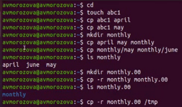
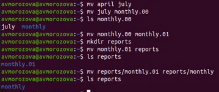
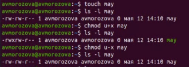
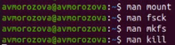
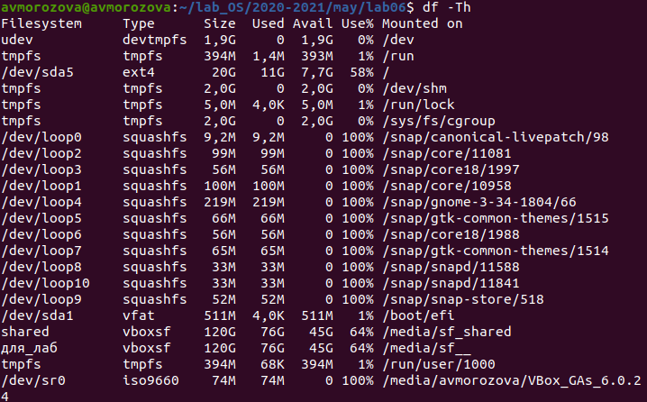

---
## Front matter
lang: ru-RU
title: Лабораторная работа №6
author: |
	Морозова Анастасия Владимировна\inst{1}
institute: |
	\inst{1}RUDN University, Moscow, Russian Federation
date: 13 мая 2021, Москва, Россия

## Formatting
toc: false
slide_level: 2
theme: metropolis
header-includes: 
 - \metroset{progressbar=frametitle,sectionpage=progressbar,numbering=fraction}
 - '\makeatletter'
 - '\beamer@ignorenonframefalse'
 - '\makeatother'
aspectratio: 43
section-titles: true
---

## Цель работы

Ознакомиться с файловой системой Linux, её структурой, именами и содержа-нием каталогов. Приобрести практические навыки по применению команд для работы с файлами и каталогами, по управлению процессами (и работами), по проверке использования диска и обслуживанию файловой системы

## Ход работы

Работала в консоли c командой копирования - cp (рис. -@fig:001)

{ #fig:001 width=70% }

## Ход работы

Работала в консоли с командой перемещения и переименовывания файлов mv (рис. -@fig:002)

{ #fig:002 width=70% }

## Ход работы

Работала с правами доступа. Изменяла их при помощи команды chmod (рис. -@fig:003)

{ #fig:003 width=70% }

## Ход работы
Используя команды man mount, man fsck, man mkfs, man kill, получала информацию о соответствующих командах (рис. -@fig:004)

{ #fig:004 width=70% }

## Ход работы

Узнала, какие файловые системы существуют на жёстком диске моего  компьютера, использую команду «df -Th» (рис. -@fig:005)

{ #fig:005 width=70% }

## Вывод

В ходе выполнения лабораторной работы я ознакомилась с файловой системой Linux, её структурой, именами и содержанием каталогов. Приобрела практические навыки по применению команд для работы с файлами и каталогами, по управлению процессами (и работами), по проверке использования диска и обслуживанию файловой системы

