---
# Front matter
lang: ru-RU
title: "Отчет по лабораторной работе №6"
subtitle: "Дисциплина: Операционные системы"
author: "Морозова Анастасия Владимировна"

# Formatting
toc-title: "Содержание"
toc: true # Table of contents
toc_depth: 2
lof: true # List of figures
lot: true # List of tables
fontsize: 12pt
linestretch: 1.5
papersize: a4paper
documentclass: scrreprt
polyglossia-lang: russian
polyglossia-otherlangs: english
mainfont: PT Serif
romanfont: PT Serif
sansfont: PT Sans
monofont: PT Mono
mainfontoptions: Ligatures=TeX
romanfontoptions: Ligatures=TeX
sansfontoptions: Ligatures=TeX,Scale=MatchLowercase
monofontoptions: Scale=MatchLowercase
indent: true
pdf-engine: lualatex
header-includes:
  - \linepenalty=10 # the penalty added to the badness of each line within a paragraph (no associated penalty node) Increasing the value makes tex try to have fewer lines in the paragraph.
  - \interlinepenalty=0 # value of the penalty (node) added after each line of a paragraph.
  - \hyphenpenalty=50 # the penalty for line breaking at an automatically inserted hyphen
  - \exhyphenpenalty=50 # the penalty for line breaking at an explicit hyphen
  - \binoppenalty=700 # the penalty for breaking a line at a binary operator
  - \relpenalty=500 # the penalty for breaking a line at a relation
  - \clubpenalty=150 # extra penalty for breaking after first line of a paragraph
  - \widowpenalty=150 # extra penalty for breaking before last line of a paragraph
  - \displaywidowpenalty=50 # extra penalty for breaking before last line before a display math
  - \brokenpenalty=100 # extra penalty for page breaking after a hyphenated line
  - \predisplaypenalty=10000 # penalty for breaking before a display
  - \postdisplaypenalty=0 # penalty for breaking after a display
  - \floatingpenalty = 20000 # penalty for splitting an insertion (can only be split footnote in standard LaTeX)
  - \raggedbottom # or \flushbottom
  - \usepackage{float} # keep figures where there are in the text
  - \floatplacement{figure}{H} # keep figures where there are in the text
---

# Цель работы

Ознакомиться с файловой системой Linux, её структурой, именами и содержа-нием каталогов. Приобрести практические навыки по применению команд для работы с файлами и каталогами, по управлению процессами (и работами), по проверке использования диска и обслуживанию файловой системы.

# Выполнение лабораторной работы

1. Выполню все примеры, приведённые в первой части описания лабораторной работы 

 - Скопирую файл  ~/abc1 в файл april и в файл may. Для этого создадим  файл abc1 (команда touch abc1), осуществляю копирование (команды cp abc1 april и cp abc1 may).
 - Скопирую файлы april и may в каталог monthly (команды mkdir monthly −  для создания каталога monthly и cp april may monthly − для копирования.
 - Скопирую файл monthly/may в файл с именем june (команды cp monthly/may monthly/june и ls monthly (для просмотра содержимого каталога)).
 - Скопирую каталог monthly в каталог monthly.00. Создаю каталог monthly.00 (команда mkdir monthly.00) и осуществляю копирование (команда cp -r monthly monthly.00)(команда cp с опцией -r (recursive) позволяет копировать каталоги вместе с входящими в них файлами и каталогами).
 - Скопирую каталог monthly.00 в каталог /tmp (команда cp -r monthly.00 /tmp) (рис. -@fig:001)
 
 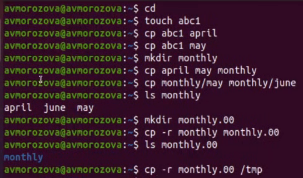{ #fig:001 width=70% }

 - Изменяю название файла april на july в домашнем каталоге (команда mv april july).
 - Перемещаю файл july в каталог monthly.00 (команда mv july monthly.00). Проверяю результат(команда ls monthly.00).
 - Переименовываю каталог monthly.00 в monthly.01 (команда mv monthly.00 monthly.01).
 - Перемещаю каталог monthly.01 в каталог reports. Создаю каталог reports (команда mkdir  reports) и выполняю перемещение (команда mv monthly.01 reports).
 - Переименовываю каталог reports/monthly.01 в reports/monthly (команда mv reports/monthly.01 reports/monthly). (рис. -@fig:002)

 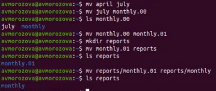{ #fig:002 width=70% }
 
 - Создаю файл ~/may с правом выполнения для владельца. Команды: 
   touch may - создание файла
   ls -l may - просмотр сведений о файле
   chmod u+x may - изменение прав
   ls -l may
   
 - Лишаю владельца файла ~/may права на выполнение. Команды:
   chmod u-x may - изменение прав
   ls -l may - просмотр сведений о файле.  (рис. -@fig:003)
   
 - Создаю каталог monthly с запретом на чтение для членов группы и всех остальных пользователей. Команды: 
  mkdir monthly - создание каталога
  chmod go-r monthly - изменение прав
  
 - Создаю файл ~/abc1 с правом записи для членов группы. Команды:
   touchabc1 - создание  файла
   chmod g+w abc1 - изменение прав (рис. -@fig:004)
   
   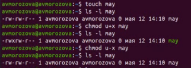{ #fig:003 width=70% }
   
   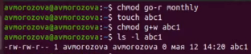{ #fig:004 width=70% }
  
2. Выполняю следующие действия:
 - Копирую файл /usr/include/sys/aio.h в домашний каталог (команда cp/usr/include/sys/aio.h ~). Назоваю его equipment (команда mv aio.h equipment).
 - В домашнем каталоге создаю директорию ~/ski.plases (команда mkdir ski.plases).
 - Перемещаю файл equipment в каталог ~/ski.plases (команда  mv equipment ski.plases).
 - Переименовываю файл ~/ski.plases/equipment в ~/ski.plases/equiplist (команда mv ski.plases/equipment ski.plases/equiplist) (рис. -@fig:005)
 - Создаю в домашнем каталоге файл abc1 (команда touch abc1) и копирую его в каталог ~/ski.plases (команда cp abc1 ski.plases). Называю его equiplist2 (команда mv ski.plases/abc1 ski.plases/equiplist2).
 - Создаю каталог с именем equipment в каталоге ~/ski.plases (команда mkdir ski.plases/equipment).
 - Перемещаю файлы ~/ski.plases/equiplist и equiplist2 в каталог ~/ski.plases/equipment (команда mv ski.plases/equiolist ski.plases/equiplist2 ski.plases/equipment).
 - Создаю (команда mkdir newdir») и перемещаю каталог ~/newdir в каталог~/ski.plases (команда mv newdir ski.plases)и называю его plans (команда mv ski.plases/newdir ski.plases/plans) (рис. -@fig:006)
 
  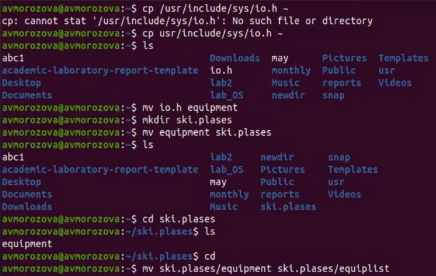{ #fig:005 width=70% }
  
  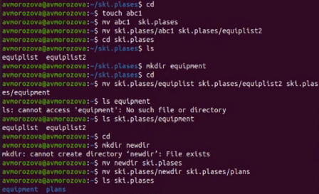{ #fig:006 width=70% }
 
3. Определяю опции команды chmod, необходимые для того, чтобы присвоить  соответствующим файлам выделенные права доступа, считая, что в начале  таких прав нет. Cоздаю необходимые файлы, используя команды: mkdir australia, mkdir play, touch my_os, touch feathers (рис. -@fig:007)
  
  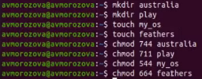{ #fig:007 width=70% }

 - **drwxr--r-- ... australia** (команда chmod 744 australia) (это каталог, владелец имеет право на чтение, запись и выполнение, группа владельца и остальные – только чтение)
 - **drwx--x--x ... play** (команда chmod 711 play)(это каталог, владелец  имеет право на чтение, запись  и  выполнение,  группа владельца и остальные –только выполнение)
 - **-r-xr--r-- ... my_o** (команда chmod 544 my_os)(это файл, владелец имеет право на чтение и выполнение, группа владельца и остальные –только чтение).
 - **-rw-rw-r-- ... feathers** (команды chmod 664 feathers)(это файл, 
владелец и группа владельца имеют право на чтение и запись, остальные –только чтение)

Командой ls -l проверяю правильность выполненных действий. (рис. -@fig:008)

 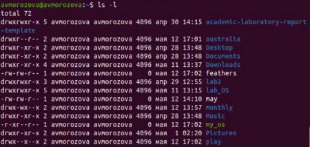{ #fig:008 width=70% }
 
4. Выполняю следующие действия: 
 - Просматриваю содержимое файла /etc/passwd (команда cat /etc/passwd) (рис. -@fig:009)
 
 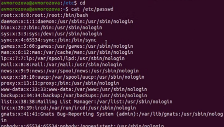{ #fig:009 width=70% }
 
 - Копирую файл ~/feathers в файл ~/file.old (команда cp feathers file.old). 
 - Перемещаю файл ~/file.old в каталог ~/play (команда mv file.ord play). 
 - Скопирую каталог ~/play в каталог ~/fun (команда cp -r play fun).
 - Перемещаю каталог ~/fun в каталог ~/play (команда mv fun play) и называю games (команда mv play/fun play/games). 
 - Лишаю владельца файла ~/feathers права на чтение (команда chmod u-r feathers) (рис. -@fig:010)
 
 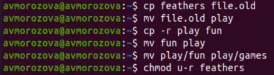{ #fig:010 width=70% }
 
 - При попытке просмотреть файл ~/feathers командой cat, получаю отказ в  доступе, т.к. в предыдущем пункте лишила владельца права на чтение данного файла.
 - При попытке скопировать файл ~/feathers получаю отказ в доступе, по той же причине причине
 - Даю владельцу файла ~/feathers право на чтение (команда chmod u+r feathers).
 - Лишаю владельца каталога ~/play права на выполнение (команда chmod u-x play). 
 - Перехожу в каталог ~/play (команда cd play). Получаю отказ в доступе,  т.к. в предыдущем пункте лишила владельца права на выполнение данного каталога.
 - Даю владельцу каталога ~/play право на выполнение (команда chmod u+x play). (рис. -@fig:011)

 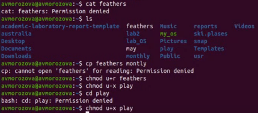{ #fig:011 width=70% }
 
5. Используя команды man mount, man fsck, man mkfs, man kill, получаю информацию о соответствующих командах (рис. -@fig:012)

 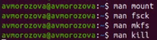{ #fig:012 width=70% }
 
 - Команда **mount**: предназначена для монтирования файловой системы. Все  файлы, доступные в Unix системах, составляют иерархическую файловую структуру, котораяимеет ветки (каталоги) и листья (файлы  в каталогах). Корень этого дерева обозначается как /. Физически файлы могут располагаться на различных устройствах. Команда mount служит для  подключения файловых систем разных устройств к этому большому дереву. (рис. -@fig:013)

 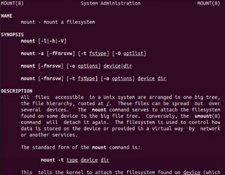{ #fig:013 width=70% }
 
 - Команда fsck: это утилита командной строки, которая позволяет выполнять проверки согласованности и интерактивное исправление в одной или нескольких файловых системах Linux. Он использует программы, специфичные для типа файловой системы, которую он проверяет.У командыfsckследующий синтаксис:fsck [параметр] --[параметры ФС] [<файловая система> . . .] Например, если нужно восстановить («починить») файловую систему на некотором устройстве /dev/sdb2, следует воспользоваться командой: «sudo fsck -y /dev/sdb2» (рис. -@fig:014)
 
  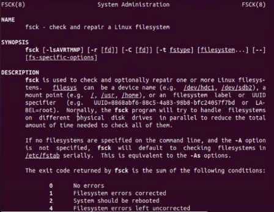{ #fig:014 width=70% }
 
 - Команда mkfs: создаёт новую файловую систему Linux. Имеет синтаксис: mkfs [-V] [-tfstype] [fs-options] filesys [blocks]. mkfs используется для создания файловой системы Linux на некотором устройстве, обычно в разделе жёсткого диска. В качестве аргументаfilesysдля файловой системы может  выступать или название устройства (например,/dev/hda1,/dev/sdb2) или  точка монтирования (например,/,/usr,/home). Аргументом blocks указывается количество блоков, которые выделяются для использования этой файловой системой.По окончании работыmkfsвозвращает 0 -в случаеуспеха, а 1 -при неудачной операции.Например, команда «mkfs -t ext2 /dev/hdb1» создаёт файловую систему типаext2в разделе/dev/hdb1(второй жёсткий диск)(рис. -@fig:015)
 
 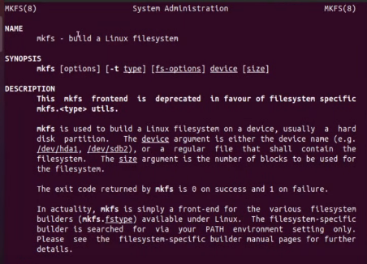{ #fig:015 width=70% }
 
 - Команда kill: посылает сигнал процессу или выводит список допустимых сигналов. Имеет следующий синтаксис: kill[опции]PID, гдеPID–это  PID  (числовой идентификатор) процесса или несколько PID процессов, если требуется послать сигнал сразу нескольким процессам.Например, команда «kill -KILL 3121» посылает сигнал KILL процессу с PID 3121, чтобы принудительно завершить процесс(рис. -@fig:016)

 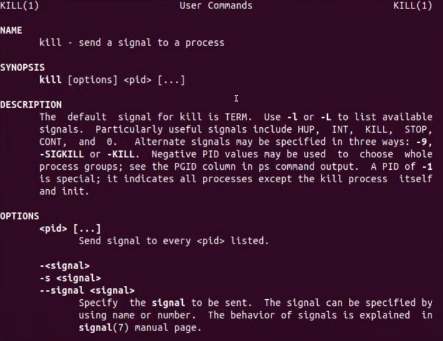{ #fig:016 width=70% }
 
6. Контрольные вопросы:
 - Чтобы узнать, какие файловые системы существуют на жёстком диске моего  компьютера,  использую  команду«df-Th».  Из рисунка  видно,  что на  моем  компьютере  есть следующие  файловыесистемы: devtmpfs,tmpfs,ext4,iso9660. (рис. -@fig:017)
  - **devtmpfs** позволяет ядру создать экземпляр tmpfs с именем devtmpfs при  инициализации  ядра,  прежде  чем  регистрируется  какое-либо устройство  с  драйверами.  Каждое  устройство  с  майором  / минором будет предоставлять узел устройства в devtmpfs.devtmpfs монтируется на /dev и содержит специальные файлы устройств для всех устройств.
  - **tmpfs** − временное  файловое  хранилище  во  многих  Unix-подобных ОС.  Предназначена  для  монтирования  файловой  системы,  но размещаетсяв ОЗУ вместо ПЗУ. Подобная конструкция является RAM диском.  Данная  файловая  система  также  предназначенная  для быстрого и ненадёжного хранения временных данных.Хорошо  подходит  для  /tmp  и  массовой  сборки  пакетов/образов.Предполагает наличие достаточного объёма виртуальной памяти.Файловая системаtmpfsпредназначенадля того, чтобы использовать часть  физической  памяти  сервера  как  обычный  дисковый  раздел,  в котором можно сохранять данные (чтение и запись). Поскольку данные размещены в памяти, то чтение или запись происходят во много раз быстрее, чем с обычного HDD диска. 
  - **ext4** − имеет обратную совместимость с предыдущими версиями ФС. Эта  версия  была  выпущена  в  2008  году.  Является  первой  ФС  из «семейства»Ext,   использующая   механизм   «extentfile     system», который  позволяет  добиться  меньшей  фрагментации  файлов  и увеличить общую производительностьфайловой системы. Кроме того, вExt4реализован  механизм  отложенной  записи  (delayed  allocation  −delalloc), который так же уменьшает фрагментацию диска и снижает нагрузку на CPU. С другой стороны, хотя механизм отложенной записи и используется во многих ФС, но в силу сложности своей реализации он повышает вероятность утери данных.Характеристики: максимальный размер файла: 16 TB;максимальный размер раздела: 16TB; максимальный размер имени файла: 255 символов.Рекомендации по использованию: наилучший выбор дляSSD; наилучшая  производительность  по сравнению  с  предыдущимиEtx-системами; она так же отлично подходит в качестве файловой системы для серверов баз данных, хотя сама система и моложе Ext3
  - **iso9660** −стандарт, выпущенный Международной организацией по стандартизации,  описывающий  файловую  систему  для  дисков  CD-ROM.  Также  известен  как  CDFS  (Compact  Disc  File  System).  Целью стандарта является обеспечить совместимость носителей под разными операционными системами, такими, как Unix, Mac OS, Windows.

 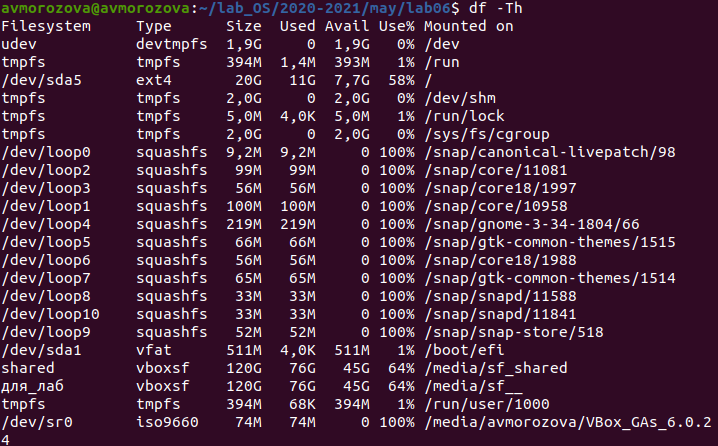{ #fig:017 width=70% }

 - Файловая система Linux/UNIXфизически   представляет   собой пространство раздела диска разбитое на блоки фиксированного размера, кратные размеру сектора − 1024, 2048, 4096 или 8120 байт. Размер блока указывается при создании файловой системы.В файловой структуре Linux имеется один корневой раздел −/ (он же root,  корень).  Все  разделы  жесткого  диска  (если  их  несколько) представляют  собой  структуру  подкаталогов,  "примонтированных"  к определенным каталогам
  - / − корень - это главный каталог в системе Linux. По сути, это и есть файловая система  Linux.Адреса  всех  файлов  начинаются  с  корня,  а дополнительные   разделы,   флешки   или   оптические   диски подключаются в папки корневого каталога. Только пользователь root имеет право читать и изменять файлы в этом каталоге. 
  - /BIN – бинарные файлы пользователя. Этот каталог содержит исполняемые  файлы. Здесь расположены программы, которые можно использовать в  однопользовательском режиме или режиме восстановления.
  - /SBIN –системные испольняемые файлыТак же как и /bin, содержит двоичные исполняемые файлы, которые доступны на ранних этапах загрузки, когда не примонтирован каталог /usr. Но здесь находятся программы, которые можно выполнять только с правами суперпользователя.
  - /ETC –конфигурационные файлыВ  этой  папке  содержатся  конфигурационные  файлы  всех  программ, установленных в системе.Кроме  конфигурационных  файлов,  в  системе  инициализации  Init Scripts,  здесь  находятся  скрипты  запуска  и  завершения  системных демонов, монтирования файловых систем и автозагрузки программ.
  - /DEV – файлы устройствВ  Linux  все,  в  том  числе  внешние  устройства  являются  файлами. Таким образом, все подключенные флешки, клавиатуры, микрофоны, камеры − это  просто  файлы  в  каталоге  /dev/.  Выполняется сканирование  всех  подключенных  устройств  и  создание  для  них специальных файлов
  - /PROC – информация о процессахПо  сути,  это  псевдофайловая  система,  содержащая  подробную информацию  о  каждом  процессе,  его  Pid,  имя  исполняемого  файла, параметры запуска, доступ к оперативной памяти и так далее. Также здесь  можно  найти  информацию  об  использовании  системных ресурсов.
  - /VAR – переменные файлы. Название  каталога  /var  говорит  само  за  себя,  он  должен  содержать файлы,  которые  часто  изменяются.  Размер  этих  файлов  постоянно увеличивается.  Здесь  содержатся  файлы  системных  журналов, различные кеши, базы данных и так далее.
  - /TMP – временные файлы. В этом каталоге содержатся временные файлы, созданные системой, любыми программами или пользователями. Все пользователи имеют право записи в эту директорию.
  - /USR – программы пользователяЭто самый большой каталог с большим количеством функций. Здесь находятся  исполняемые  файлы,  исходники  программ, различные ресурсы приложений, картинки, музыку и документацию.
  - /HOME – домашняя папкаВ этой папке хранятся домашние каталоги всех пользователей. В них они могут хранить свои личные файлы, настройки программ и т.д. 
  - /BOOT – файлы загрузчикаСодержит  все  файлы,связанные  с  загрузчиком системы.  Это  ядро vmlinuz, образ initrd, а также файлы загрузчика, находящие в каталоге /boot/grub.
  - /LIB – системные библиотекиСодержит  файлы  системных  библиотек,  которые  используются исполняемыми файлами в каталогах /bin и /sbin./OPT–дополнительные программыВ  эту  папку  устанавливаются  проприетарные  программы, игры или драйвера. Это программы созданные в виде отдельных исполняемых файлов самими производителями.
  - /MNT – монтирование. В этот каталог системные администраторы  могут  монтировать внешние или дополнительные файловые системы.
  - /MEDIA – съемные носители. В этот каталог система монтирует все  подключаемые внешние накопители –USB флешки, оптические  диски  и  другие  носители информации.
  - /SRV – сервер В этом каталоге содержатся файлы серверов и сервисов. 
  - /RUN - процессы. Каталог, содержащий PID файлы процессов, похожий на /var/run, но в отличие от него, он размещен в TMPFS, а поэтому после перезагрузки все файлы теряются

 - Чтобы содержимое некоторой файловой системы было доступно операционной системе необходимо воспользоваться командой mount.

 - Целостность файловой системы может быть нарушена из-за перебоев в питании, неполадок в оборудовании или из-за некорректного/внезапного выключения компьютера. Чтобы устранить повреждения файловой системы необходимо использовать команду fsck.

 - Файловую систему можно создать, используя команду mkfs.

 - Для просмотра текстовых файлов существуют следующие команды: сat Задача команды cat очень проста − она читает данные из файла или стандартного ввода и выводит их на экран. Синтаксис утилиты: cat [опции] файл1 файл2 ...
 Основные опции: 
  - -b – нумеровать только непустые строки 
  - -E – показывать символ $ в конце каждой строки 
  - -n – нумеровать все строки 
  - -s – удалять пустые повторяющиеся строки 
  - -T – отображать табуляции в виде ^I 
  - -h – отобразить справку 
  - -v – версия утилиты 
 
 nl: команда nl действует аналогично команде cat, но выводит еще и номера строк в столбце слева. 
 less: существенно более развитая команда для пролистывания текста. При чтении данных со стандартного ввода она создает буфер,который позволяет листать текст как вперед, так и назад, а также искать как по направлению к концу, так и по направлению к началу текста. Синтаксис аналогичный синтаксису команды cat. Некоторые опции: 
 -g – при поиске подсвечивать только текущее найденное слово (по умолчанию подсвечиваются все вхождения) 
 -N – показывать номера строк 
 head: команда head выводит начальные строки (по умолчанию − 10) из одного или нескольких документов. Также она может показывать данные, которые передает на вывод другая утилита. Синтаксис аналогичный синтаксису команды cat. Основные опции: 
 -c (--bytes) − позволяет задавать количество текста не в строках, а в байтах 
 -n (--lines) − показывает заданное количество строк вместо 10, которые выводятся по умолчанию 
 -q (--quiet, --silent) − выводит только текст, не добавляя к нему название файла 
 -v (--verbose) − перед текстом выводит название файла
 -z (--zero-terminated) − символы перехода на новую строку заменяет символами завершения строк 
 tail: эта команда позволяет выводить заданное количество строк с конца файла, а также выводить новые строки в интерактивном режиме. Синтаксис аналогичный синтаксису команды cat. Основные опции: 
 -c − выводить указанное количество байт с конца файла 
 -f − обновлять информацию по мере появления новых строк в файле 
 -n − выводить указанное количество строк из конца файла 
 --pid − используется с опцией -f, позволяет завершить работу утилиты, когда завершится указанный процесс 
 -q − не выводить имена файлов 
 --retry − повторять попытки открыть файл, если он недоступен 
 -v − выводить подробную информацию о файле

 - Утилита cp позволяет полностью копировать файлы и директории. Cинтаксис: cp [опции] файл-источник файл-приемник. После выполнения команды файл-источник будет полностью перенесен в файл-приемник. Если в конце указан слэш, файл будет записан в заданную директорию с оригинальным именем. Основные опции: 
 --attributes-only − не копировать содержимое файла, а только флаги доступа и владельца 
 -f, --force − перезаписывать существующие файлы 
 -i, --interactive − спрашивать, нужно ли перезаписывать существующие файлы 
 -L − копировать не символические ссылки, а то, на что они указывают 
 -n − не перезаписывать существующие файлы 
 -P − не следовать символическим ссылкам 
 -r − копировать папку Linux рекурсивно 
 -s − не выполнять копирование файлов в Linux, а создавать символические ссылки 
 -u − скопировать файл, только если он был изменён 
 -x − не выходить за пределы этой файловой системы 
 -p − сохранять владельца, временные метки и флаги доступа при копировании
 -t − считать файл-приемник директорией и копировать файл-источник в эту директорию

 - Команда mv используется для перемещения одного или нескольких файлов (или директорий) в другую директорию, а также для переименования файлов и директорий. Синтаксис: mv [-опции] старый_файл новый_файл
 Основные опции: 
 --help − выводит на экран официальную документацию об утилите 
 --version − отображает версию mv 
 -b − создает копию файлов, которые были перемещены или перезаписаны 
 -f − при активации не будет спрашивать разрешение у владельца файла, если речь идет о перемещении или переименовании файла 
 -i − наоборот, будет спрашивать разрешение у владельца 
 -n − отключает перезапись уже существующих объектов 
 --strip-trailing-slashes — удаляет завершающий символ / у файла при его наличии 
 -t [директория] — перемещает все файлы в указанную директорию 
 -u − осуществляет перемещение только в том случае, если исходный файл новее объекта назначения 
 -v − отображает сведения о каждом элементе во время обработки команды

 Команда rename также предназначена, чтобы переименовать файл. Синтаксис: rename [опции] старое_имя новое_имя файлы 
 Основные опции: 
 -v − вывести список обработанных файлов 
 -n − тестовый режим, на самом деле никакие действия выполнены не будут 
 -f − принудительно перезаписывать существующие файлы

 - Права доступа − совокупность правил, регламентирующих порядок и условия доступа субъекта к объектам информационной системы (информации, её установленных носителям, правовыми процессам и документами другим или ресурсам) собственником,владельцем информации. Права доступа к файлу или каталогу можно изменить, воспользовавшись командой chmod. Сделать это может владелец файла (или каталога) или пользователь с правами администратора. Синтаксис команды: chmod режим имя_файла Режим имеет следующие компоненты структуры и способ записи: 
 - = установить право
 - -лишить права
 - +дать право
 - r чтение
 - w запись
 - x выполнение
 - u (user) владелец файла
 - g (group) группа, к которой принадлежит владелец файла
 - o (others) все остальные

# Выводы

В ходе выполнения лабораторной работы я ознакомилась с файловой системой Linux, её структурой, именами и содержанием каталогов. Приобрела практические навыки по применению команд для работы с файлами и каталогами, по управлению процессами (и работами), по проверке использования диска и обслуживанию файловой системы.
