---
# Front matter
lang: ru-RU
title: "Отчет по лабораторной работе №9"
subtitle: "Дисциплина: Операционные системы"
author: "Морозова Анастасия Владимировна"

# Formatting
toc-title: "Содержание"
toc: true # Table of contents
toc_depth: 2
lof: true # List of figures
lot: true # List of tables
fontsize: 12pt
linestretch: 1.5
papersize: a4paper
documentclass: scrreprt
polyglossia-lang: russian
polyglossia-otherlangs: english
mainfont: PT Serif
romanfont: PT Serif
sansfont: PT Sans
monofont: PT Mono
mainfontoptions: Ligatures=TeX
romanfontoptions: Ligatures=TeX
sansfontoptions: Ligatures=TeX,Scale=MatchLowercase
monofontoptions: Scale=MatchLowercase
indent: true
pdf-engine: lualatex
header-includes:
  - \linepenalty=10 # the penalty added to the badness of each line within a paragraph (no associated penalty node) Increasing the value makes tex try to have fewer lines in the paragraph.
  - \interlinepenalty=0 # value of the penalty (node) added after each line of a paragraph.
  - \hyphenpenalty=50 # the penalty for line breaking at an automatically inserted hyphen
  - \exhyphenpenalty=50 # the penalty for line breaking at an explicit hyphen
  - \binoppenalty=700 # the penalty for breaking a line at a binary operator
  - \relpenalty=500 # the penalty for breaking a line at a relation
  - \clubpenalty=150 # extra penalty for breaking after first line of a paragraph
  - \widowpenalty=150 # extra penalty for breaking before last line of a paragraph
  - \displaywidowpenalty=50 # extra penalty for breaking before last line before a display math
  - \brokenpenalty=100 # extra penalty for page breaking after a hyphenated line
  - \predisplaypenalty=10000 # penalty for breaking before a display
  - \postdisplaypenalty=0 # penalty for breaking after a display
  - \floatingpenalty = 20000 # penalty for splitting an insertion (can only be split footnote in standard LaTeX)
  - \raggedbottom # or \flushbottom
  - \usepackage{float} # keep figures where there are in the text
  - \floatplacement{figure}{H} # keep figures where there are in the text
---

# Цель работы

Познакомиться с операционной системой Linux. Получить практические навыки работы с редактором vi, установленным по умолчанию практически во всех дистрибутивах.

# Задание

1. Ознакомиться с теоретическим материалом.
2. Ознакомиться с редактором vi.
3. Выполнить упражнения, используя команды vi.

# Выполнение лабораторной работы

1. **Задание №1. Создание нового файла с использованием vi**
  1. Создаю в домашней дирректории каталог work/os/lab09 (команда mkdir -p work/os/lab09, опция -p позволяет создать все каталоги, которые указаны внутри пути)
  2. Перехожу в созданный каталог (команда cd work/os/lab09)
  3. Вызываю редактор vi и создаю файл hello.shс (команда vi hello.sh) (рис. -@fig:001) (рис. -@fig:002)
 
  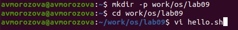{ #fig:001 width=70% }

  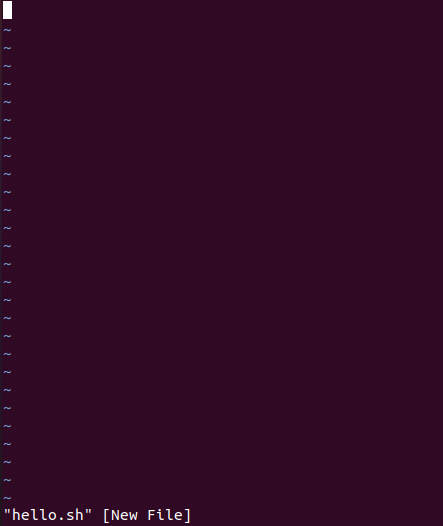{ #fig:002 width=70% }
 
  4. Нажимаю клавишу «i» и ввожу текст из лабораторной работы (рис. -@fig:003)
   
  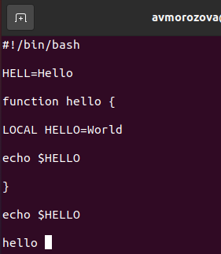{ #fig:003 width=70% }
   
  5. Нажимаю клавишу «esc» для перехода в командный режим после завершения ввода текста 
  
  6. Нажимаю «:» для перехода в режим последней строки и внизу экрана вижу, что появилось приглашение в виде двоеточия (рис. -@fig:004)
 
  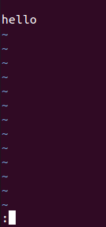{ #fig:004 width=70% }
  
  7. Нажимаю «w» (записать) и «q» (выйти), далее нажимаю клавишу «enter» для сохранения текста и завершения работы (рис. -@fig:005)
  
  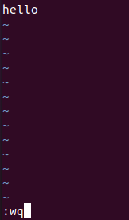{ #fig:005 width=70% }
  
  8. Делаю файл исполняемым (команда chmod +x hello.sh)(рис. -@fig:006)
  
  { #fig:006 width=70% }

2. **Задание №2. Редактирование существующего файла**
  1. Вызываю vi на редактирование файла (команда vi ~/work/os/lab09/hello.sh)(рис. -@fig:007)(рис. -@fig:008)

 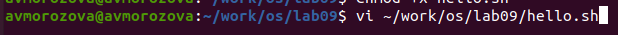{ #fig:007 width=70% }
 
 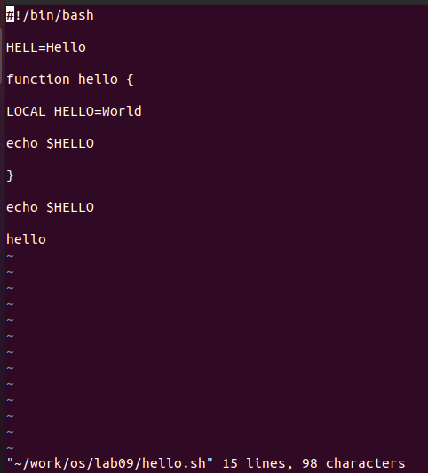{ #fig:008 width=70% }
 
 2. Далее с помощью стрелок устанавливаю курсор в конец слова HELL второй строки (рис. -@fig:009)
 
 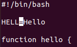{ #fig:009 width=70% }
 
 3. Перехожу в режим вставки, нажав на клавишу «i», и заменяю HELL на 
HELLO. Нажимаю «esc» для возврата в командный режим (рис. -@fig:010)
 
 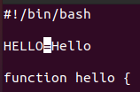{ #fig:010 width=70% }
 
 4. С помощью стрелок устанавливаю курсор на четвертую строку(рис. -@fig:011) и стираю слово LOCAL с помощью комбинации клавиш «d»(delete) и «w»(word)(рис. -@fig:012)

 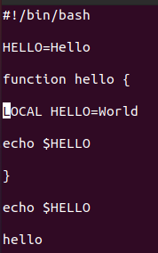{ #fig:011 width=70% }

 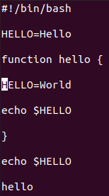{ #fig:012 width=70% }
 
 5. Перехожу в режим вставки, нажав клавишу «i», и набираю следующий текст: local. Нажимаю «esc» для возврата в командный режим (рис. -@fig:013)

 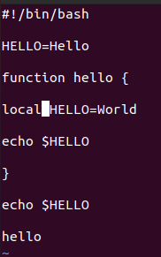{ #fig:013 width=70% }
 
 6. Устанавливаю курсор на последней строке файла, используя стрелки(рис. -@fig:014). Вставляю после неё строку, содержащую следующий текст: echo $HELLO(рис. -@fig:015)
  
  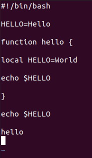{ #fig:014 width=70% }
 
  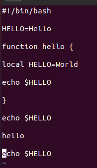{ #fig:015 width=70% }
  
  7. Нажимаю «esc», чтобы перейти в командный режим.
  8. Удаляю  последнюю  строку,  используя  комбинацию  клавиш «d» и «d» (рис. -@fig:016)

  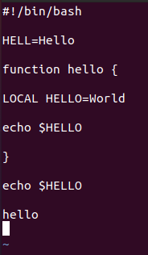{ #fig:016 width=70% }
  
  9. Введe команду отмены изменений «u» для отмены последней команды (рис. -@fig:017)

 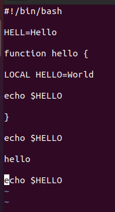{ #fig:017 width=70% }
 
  10. Ввожу символ «:» для перехода в режим последней строки. Записываю произведённые изменения, нажав «w» и «q» и выхожу из vi (рис. -@fig:018)
  
  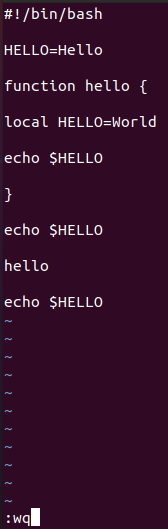{ #fig:018 width=70% }

3. **Контрольные вопросы**

  1) Редактор vi имеет три режима работы:
   - командный режим −предназначен для ввода команд редактирования и навигации по редактируемому файлу;
   - режим  вставки  − предназначен  для  ввода  содержания редактируемого файла;
   - режим последней (или командной) строки − используется для записи изменений в файл и выхода из редактора.
  2) Чтобы выйти из редактора, не сохраняя произведённые изменения, нужно в режиме командной строки нажать клавиши «:» «q» «!»
  3) Команды позиционирования:
   - «0»(ноль) − переход в начало строки; 
   - «$» − переход в конец строки;
   - «G» − переход в конец файла; 
   - n«G» − переход на строку с номером n.
  4) При использовании прописных W и B под разделителями понимаются только пробел, табуляция и возврат каретки. При использовании строчных w и b под разделителями понимаются также любые знаки пунктуации.
  5) Чтобы из любого места редактируемого файла перейти в начало (конец) файла, нужно в режиме командной строки нажать клавиши «1» «G»(«G»)
  6) Команды редактирования: 
  Вставка текста 
   - «а» − вставить текст после курсора;
   - «А» − вставить текст в конец строки;
   - «i» − вставить текст перед курсором;
   - n«i» − вставить текст nраз;
   - «I» − вставить текст в начало строки. 
   
  Вставка строки
   - «о» − вставить строку под курсором;
   - «О» − вставить строку над курсором. 
   
  Удаление текста
   - «x» − удалить один символ в буфер;
   - «d»«w» − удалить одно слово в буфер;
   - «d»«$» − удалить в буфер текст от курсора до конца строки;
   - «d»«0» − удалить в буфер текст от начала строки до позиции курсора;
   - «d»«d» − удалить в буфер одну строку;
   - n«d»«d» − удалить в буфер nстрок. 
   
  Отмена и повтор произведённых изменений 
   - «u» − отменить последнее изменение;
   - «.» − повторить последнее изменение.
   
  Копирование текста в буфер
   - «Y» − скопировать строку в буфер;
   - n«Y» − скопировать nстрок в буфер;
   - «y»«w» − скопировать слово в буфер.
 
  Вставка текста из буфера
   - «p» − вставить текст из буфера после курсора;
   - «P» − вставить текст из буфера перед курсором.
   
  Замена текста
   - «c»«w» − заменить слово;
   - n«c»«w» − заменить nслов;
   - «c»«$» − заменить текст от курсора до конца строки;
   - «r» − заменить слово;
   - «R» − заменить текст.
   
  Поиск текста
   - «/» текст − произвести поиск вперёд по тексту указанной строки символов текст;
   - «?» текст − произвести поиск назад по тексту указанной строки символов текст.
  
  Копирование и перемещение текста
   - «:» n,m «d» – удалить строки с n по m;
   - «:» i,j «m» k – переместить строки с i по j, начиная со строки k;
   - «:» i,j «t» k – копировать строки с i по j в строку k;
   - «:» i,j «w» имя-файла – записать строки с i по j в файл с именем имя-файла.
  
  7) Чтобы заполнить строку символами $, необходимо для начала перейти на эту строку, нажав клавиши n«G», где n–номер строки, далее нажать «0» для перехода в начало строки. Теперь необходимо нажать «c»«$», чтобы заменить текст от курсорадо конца строки, и ввести символы $.
  8) Чтобы отменить по одному предыдущему действию последовательно,необходимо нажать «u». Чтобы отменить все изменения, произведённые со времени последней записи, нужно нажать «:» «e» «!».
  9) Команды редактирования в режиме командной строкиКопирование и перемещение текста
   - «:»n,m «d»−удалить строки с n по m;
   - «:»i,j «m»k −переместить строки с i по j, начиная со строки k;
   - «:»i,j «t»k −копировать строки с i по j в строку k;
   - «:»i,j «w»имя-файла−записать строки с i по j в файл с именем имя-файла.
  Запись в файл и выход из редактора
   - «:»«w»−записать изменённый текст в файл, не выходя из vi;
   - «:»«w» имя-файла−записать изменённый текст в новый файл с именем имя-файла;
   - «:»«w»«!»имя-файла−записать изменённый текст в файл с именем имя-файла;
   - «:»«w»«q»−записать изменения в файл и выйти из vi;
   - «:»«q»−выйти из редактора vi;
   - «:»«q»«!»−выйти из редактора без записи;
   - «:»«e»«!»−вернуться  в  командный  режим,  отменив  все изменения, произведённые со времени последней записи.ОпцииОпции редактора viпозволяют настроить рабочую среду. 
  
  Для задания опций используется команда set (в режиме последней строки):
   - «:»set all − вывести полный список опций;
   - «:»set nu − вывести номера строк;
   - «:»set list − вывести невидимые символы;
   - «:»set  ic − не  учитывать  при  поиске,  является  ли  символ прописным илистрочным.
  Если вы хотите отказаться от использования опции, то в команде set перед именем опции надо поставить no.
  10) Чтобы определить,  не  перемещая  курсора,  позицию,  в  которой заканчивается строка, нужно в командном режиме находясь на нужной строке нажать «$» и посмотреть на число после запятой в правом нижнем углу экрана
  11) Опции  редактора vi позволяют  настроить  рабочую  среду.  Для задания опций используется команда set(в режиме команднойстроки). Если вы хотите отказаться от использования опции, то в команде setперед именем опции надо поставить no.Чтобы просмотреть опции редактора vi, необходимо нажать «:» setall. Нажав «:» help "название_опции", можно узнать назначение конкретной опции. 
  12) В режиме командной строки внизу редактора присутствует «:», в режиме ввода –«--ВСТАВКА --», в командном режиме внизу ничего нет.
  13) Граф взаимосвязи режимов работы редактора vi (рис. -@fig:019)
  
  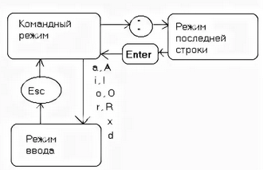{ #fig:019 width=70% }
  
# Выводы

В ходе выполнения лабораторной работы я познакомилась с операционной системой Linux. Получила практические навыки работы с редактором vi, установленным по умолчанию практически во всех дистрибутивах.
