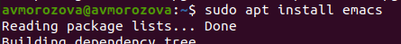
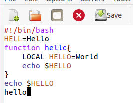
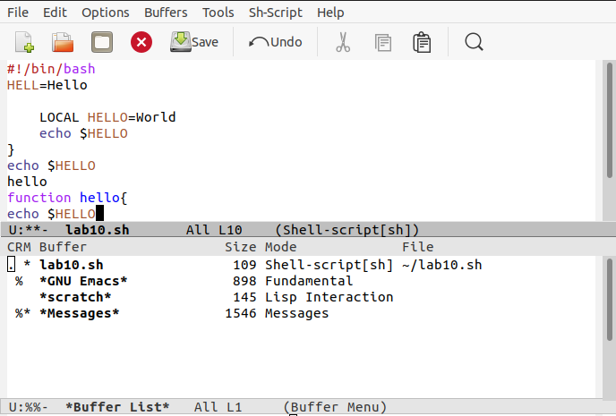
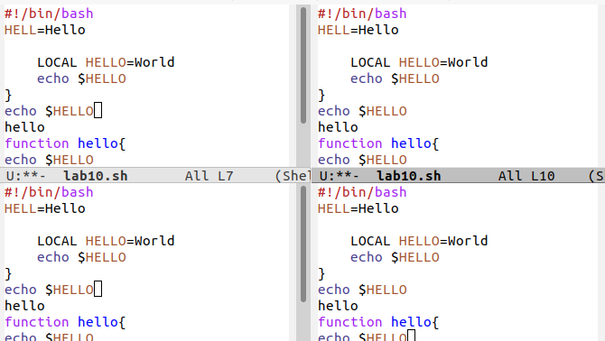
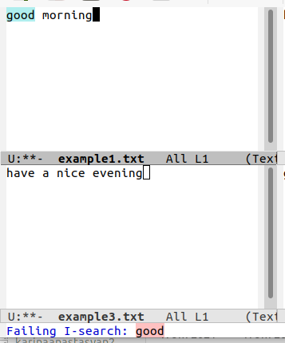

---
## Front matter
lang: ru-RU
title: Лабораторная работа №10
author: |
	Морозова Анастасия Владимировна\inst{1}
institute: |
	\inst{1}RUDN University, Moscow, Russian Federation
date: 20 мая 2021, Москва, Россия

## Formatting
toc: false
slide_level: 2
theme: metropolis
header-includes: 
 - \metroset{progressbar=frametitle,sectionpage=progressbar,numbering=fraction}
 - '\makeatletter'
 - '\beamer@ignorenonframefalse'
 - '\makeatother'
aspectratio: 43
section-titles: true
---

## Цель работы

Познакомиться с операционной системой Linux. Получить практические навыки работы с редактором Emacs.

## Задание

1. Ознакомиться с теоретическим материалом.
2. Ознакомиться с редактором emacs.
3. Выполнить упражнения.

## Ход работы

Установила редактор Emacs(рис. -@fig:001)

{ #fig:001 width=70% }

## Ход работы

В редакторе создала файл lab10.sh, набирала текст, сохраняла файл, совершала процедуры редактирования, использовала команды по пермещению курсора. (рис. -@fig:002)

{ #fig:002 width=50% }

## Ход работы

Управляла буферами (рис. -@fig:003)

{ #fig:003 width=70% }

## Ход работы

Управляла окнами (рис. -@fig:004)

{ #fig:004 width=70% }

## Ход работы

Освоила режим поиска (рис. -@fig:005)

{ #fig:005 width=50% }

## Вывод

В ходе выполнения лабораторной работы я познакомилась с операционной системой Linux и получила практические навыки работы с редактором Emacs.

