---
# Front matter
lang: ru-RU
title: "Отчет по лабораторной работе №10"
subtitle: "Дисциплина: Операционные системы"
author: "Морозова Анастасия Владимировна"

# Formatting
toc-title: "Содержание"
toc: true # Table of contents
toc_depth: 2
lof: true # List of figures
lot: true # List of tables
fontsize: 12pt
linestretch: 1.5
papersize: a4paper
documentclass: scrreprt
polyglossia-lang: russian
polyglossia-otherlangs: english
mainfont: PT Serif
romanfont: PT Serif
sansfont: PT Sans
monofont: PT Mono
mainfontoptions: Ligatures=TeX
romanfontoptions: Ligatures=TeX
sansfontoptions: Ligatures=TeX,Scale=MatchLowercase
monofontoptions: Scale=MatchLowercase
indent: true
pdf-engine: lualatex
header-includes:
  - \linepenalty=10 # the penalty added to the badness of each line within a paragraph (no associated penalty node) Increasing the value makes tex try to have fewer lines in the paragraph.
  - \interlinepenalty=0 # value of the penalty (node) added after each line of a paragraph.
  - \hyphenpenalty=50 # the penalty for line breaking at an automatically inserted hyphen
  - \exhyphenpenalty=50 # the penalty for line breaking at an explicit hyphen
  - \binoppenalty=700 # the penalty for breaking a line at a binary operator
  - \relpenalty=500 # the penalty for breaking a line at a relation
  - \clubpenalty=150 # extra penalty for breaking after first line of a paragraph
  - \widowpenalty=150 # extra penalty for breaking before last line of a paragraph
  - \displaywidowpenalty=50 # extra penalty for breaking before last line before a display math
  - \brokenpenalty=100 # extra penalty for page breaking after a hyphenated line
  - \predisplaypenalty=10000 # penalty for breaking before a display
  - \postdisplaypenalty=0 # penalty for breaking after a display
  - \floatingpenalty = 20000 # penalty for splitting an insertion (can only be split footnote in standard LaTeX)
  - \raggedbottom # or \flushbottom
  - \usepackage{float} # keep figures where there are in the text
  - \floatplacement{figure}{H} # keep figures where there are in the text
---

# Цель работы

Познакомиться с операционной системой Linux. Получить практические навыки работы с редактором Emacs.

# Задание

1. Ознакомиться с теоретическим материалом.
2. Ознакомиться с редактором emacs.
3. Выполнить упражнения.
4. Ответить на контрольные вопросы.

# Выполнение лабораторной работы

1. Устанавливаю редактор emacs (команды sudo apt-get update и sudo apt-get install emacs» (рис. -@fig:001) (рис. -@fig:002)
 
  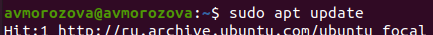{ #fig:001 width=70% }

  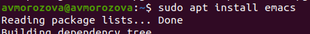{ #fig:002 width=70% }
 
2. Открываю редактор Emacs (команда emacs &)(рис. -@fig:003)
   
  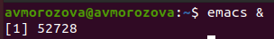{ #fig:003 width=70% }
   
3. Создаю файл lab10.sh с помощью комбинации «Ctrl-x»«Ctrl-f»(рис. -@fig:004)
  
  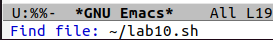{ #fig:004 width=70% }
  
4. В открывшемся буфере набираю необходимый текст. Сохраняю файл с помощью комбинации «Ctrl-x»«Ctrl-s» (рис. -@fig:005)
 
  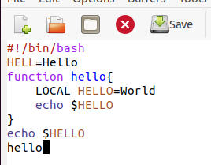{ #fig:005 width=70% }
  
5. Проделываю с текстом стандартные процедуры редактирования, каждое действие осуществляю комбинацией клавиш.
  
  - Вырезаю одной командой целую строку («Сtrl-k») (рис. -@fig:006)
  
  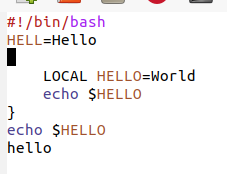{ #fig:006 width=70% }
  
  - Вставляю эту строку в конец файла («Ctrl-y»)(рис. -@fig:007)
  
  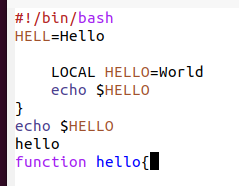{ #fig:007 width=70% }
  
  - Выделение области текста («Ctrl-space»)(рис. -@fig:008)

  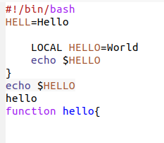{ #fig:008 width=70% }
  
  - Копирую область в буфер обмена («Alt-w»).
  - Вставляю область в конец файла(«Ctrl-y») (рис. -@fig:009)
 
  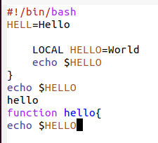{ #fig:009 width=70% }
  
  - Вновь выделяю эту область(«Ctrl-space»)(рис. -@fig:010)и вырезаю её («Ctrl-w»)(рис. -@fig:011)
 
  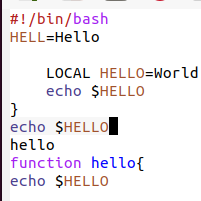{ #fig:010 width=70% }
 
  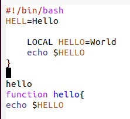{ #fig:011 width=70% }
  
  - Отменяю последнее действие («Ctrl-/»)(рис. -@fig:012)

  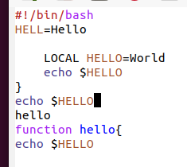{ #fig:012 width=70% }
 
6. Использую команды по перемещению курсора

  - Перемещаю курсор в начало строки («Ctrl-a»)(рис. -@fig:013)(рис. -@fig:014)
  
  { #fig:013 width=70% }
  
  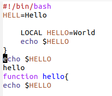{ #fig:014 width=70% }
  
  - Перемещаю курсор в конец строки («Ctrl-e»)(рис. -@fig:015)
 
  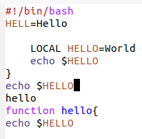{ #fig:015 width=70% }
  
  - Перемещаю курсор в начало буфера («Alt-<»)(рис. -@fig:016)

  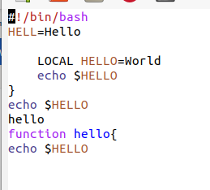{ #fig:016 width=70% }
  
  - Перемещаю курсор в конец буфера («Alt->»)(рис. -@fig:017)

  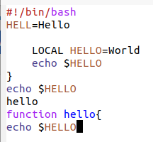{ #fig:017 width=70% }
  
7. Управление буферами:
  
  - Вывожу список активных буферов на экран («Ctrl-x»«Ctrl-b»)(рис. -@fig:018)
  
  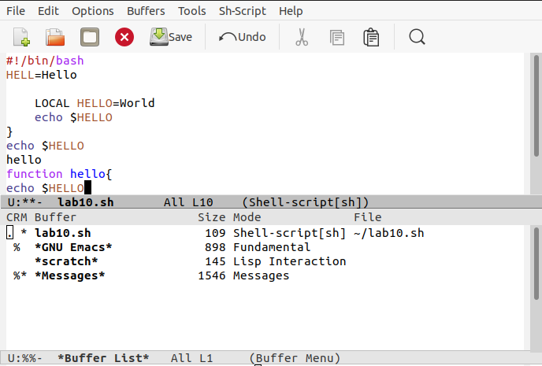{ #fig:018 width=70% }
  
  - Перемещаюсь в открытое окно («Ctrl-xo») со списком открытых буферов(рис. -@fig:019) и переключаюсь на другой буфер(для этого необходимо нажать на «enter» после выбора необходимого буфера) (рис. -@fig:020)
  
  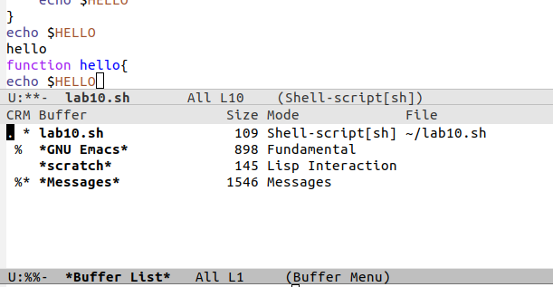{ #fig:019 width=70% }
  
  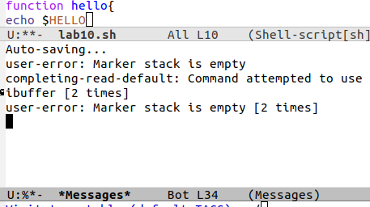{ #fig:020 width=70% }
  
  - Закрываю это окно («Ctrl-x0»)(рис. -@fig:021)
  
  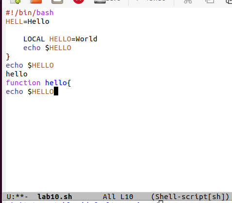{ #fig:021 width=70% }
  
  - Переключаюсь между буферами, но уже без вывода их списка на экран («Ctrl-x b») (рис. -@fig:022)
  
  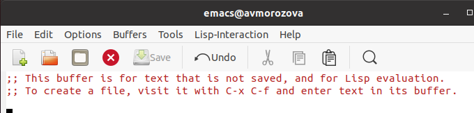{ #fig:022 width=70% }
 
8. Управление окнами:
 
  - Делю фрейм на 4 части: разделю фрейм на два окна по вертикали («Ctrl-x 3»), а затем каждое из этих окон на две части по горизонтали («Ctrl-x 2»)(рис. -@fig:023)(рис. -@fig:024)(рис. -@fig:025)
  
  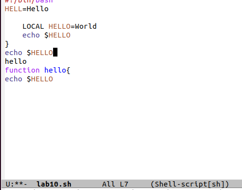{ #fig:023 width=70% }
  
  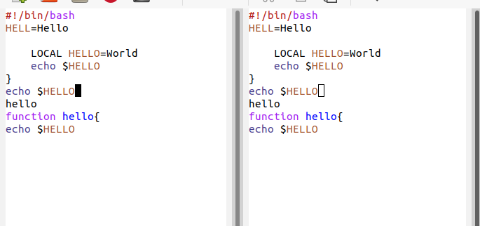{ #fig:024 width=70% }
  
  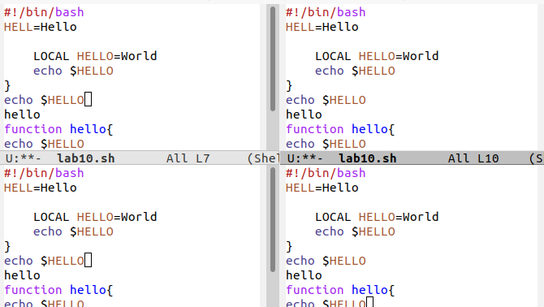{ #fig:025 width=70% }
  
  - В каждом из четырёх созданных окон открываю новый буфер (файл) и ввожу несколько строк текста. Для этого предварительно создаю эти файлы (команды touch example1.txt, touch example2.txt, touch example3.txt, touch example4.txt) (рис. -@fig:026)(рис. -@fig:027)(рис. -@fig:028)
  
  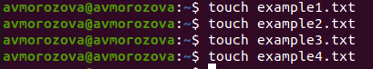{ #fig:026 width=70% }
  
  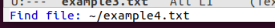{ #fig:027 width=70% }
  
  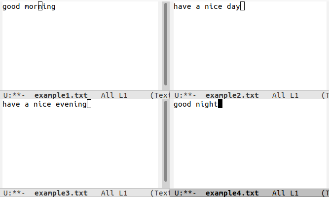{ #fig:028 width=70% }
  
9. Режим поиска:

  - Переключаюсь в режим поиска («Ctrl-s») и нахожу несколько слов, присутствующих в тексте(рис. -@fig:029)
  
  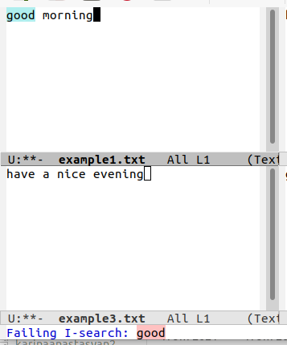{ #fig:029 width=70% }
  
  - Переключаюсь между результатами поиска, нажимая «Ctrl-s» (рис. -@fig:030)(рис. -@fig:031)
  
  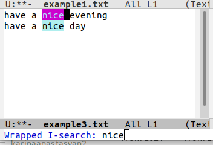{ #fig:030 width=70% }
  
  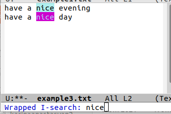{ #fig:031 width=70% }
  
  - Выхожу из режима поиска, нажав «Ctrl-g» (рис. -@fig:032)
  
  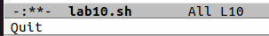{ #fig:032 width=70% }
  
  - Перехожу в режим поиска и замены  («Alt-%»),  ввожу текст, который следует найти и заменить, нажимаю «enter», затем ввожу текст для замены.  После того как будут подсвечены результаты поиска, нажимаю «!» для подтверждения замены. Важно, чтобы курсор находился в начале текста.(рис. -@fig:033)(рис. -@fig:034)(рис. -@fig:035)(рис. -@fig:036)
  
  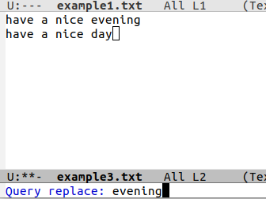{ #fig:033 width=70% }
  
  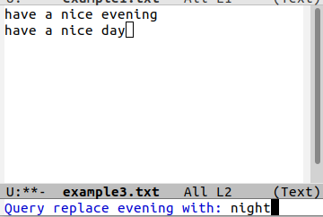{ #fig:034 width=70% }
  
  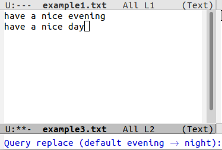{ #fig:035 width=70% }
  
  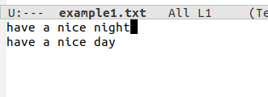{ #fig:036 width=70% }
  
  - Испробую другой режим поиска, нажав «Alt-so»(рис. -@fig:036)(рис. -@fig:037)
  
  Данный вид поиска отличается от обычного тем, что тут считывается строка поиска, которая трактуется как регулярное выражение, и не осуществляется поиск точного совпадения в тексте буфера. Регулярное выражение − это образец, который обозначает набор строк, возможно, и неограниченный набор
  
  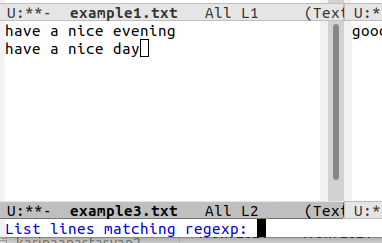{ #fig:037 width=70% }
  
  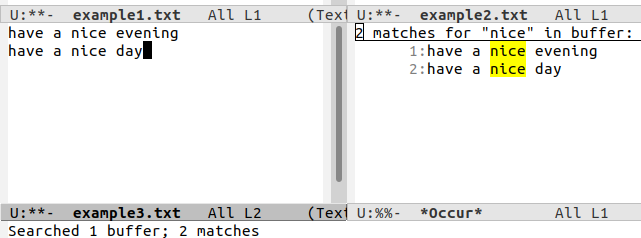{ #fig:038 width=70% }
  
10. Контрольные вопросы:

  1) Emacs − один  из  наиболее  мощных  и  широко  распространённых редакторов,  используемых  в  мире Unix.  По  популярности  он соперничает с редактором vi и его клонами. В зависимости от ситуации, Emacs может быть:
  - текстовым редактором
  - программой для чтения почты и новостей Usenet
  - интегрированной средой разработки (IDE)
  - операционной системой и т.д.
  Всё это разнообразие достигается благодаря архитектуре Emacs, которая  позволяет расширять возможности редактора при помощи языка Emacs  Lisp. На языке C написаны лишь самые базовые и низкоуровневые части Emacs, включая  полнофункциональный интерпретатор языка Lisp. Таким образом, Emacs имеет встроенный язык программирования, который может использоваться для настройки, расширения и изменения поведения редактора.  В  действительности, большая часть того редактора, с которым пользователи Emacs работают в наши дни,написана на языке Lisp.
  
  2) Основную трудность для новичков при освоении данного редактора могут составлять большое количество команд, комбинаций клавиш, которые не получится все запомнить с первого раза и поэтому придется часто обращаться к справочным материалам.
  
  3) Буфер – это  объект, представляющий собой текст. Если имеется несколько буферов, то редактировать можно только один. Обычно буфер считывает данные из файла или записывает в файл данные из буфера. Окно –это область экрана, отображающая буфер. При запуске редактора отображается одно окно, но при обращении к некоторым функциям могут открыться дополнительные окна. Окна Emacsи окна графической среды X Window – разные вещи. Одно окно X Window может быть разбито на несколько окон в смысле Emacs, в каждом из которых отображается отдельный буфер.
  
  4) Да, можно.
  5) При запуске Emacsпо умолчанию создаются следующие буферы:
  - «scratch»(буфер для несохраненного текста)
  - «Messages»(журнал ошибок, включающий также информацию, которая появляется в области EchoArea)
  - «GNUEmacs»(справочный буфер о редакторе)
  
  6) C-c |сначала, удерживая «ctrl»,нажимаю «c»,после – отпускаю обе клавиши и нажимаю «|» C-cC-|сначала, удерживая «ctrl»,нажимаю «с», после –отпускаю обе клавиши и, удерживая «ctrl», нажимаю «|»
  
  7) Чтобы  поделить  окно  на  две  части  необходимо  воспользоваться комбинацией «Ctrl-x 3»(по вертикали) или «Ctrl-x 2» (по горизонтали).
  
  8) Настройки Emacsхранятся в файле .emacs.
  9) По умолчанию клавиша «←» удаляет символперед курсором, но в редакторе её можно переназначить. Для этого необхдимо изменить конфигурацию файла .emacs.
  10) Более удобным я считаю редактор emacs, потому чтов нем проще открывать другие файлы, можно использовать сразу несколько окон, нет «Командногорежима», «Режима ввода», «Режима командной строки», которые  являются немного непривычными и в какой-то степени неудобными

# Выводы

В ходе выполнения лабораторной работы я познакомилась с операционной системой Linux. Получила практические навыки работы с редактором Emacs.
 
