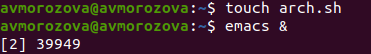
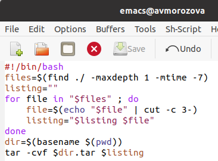
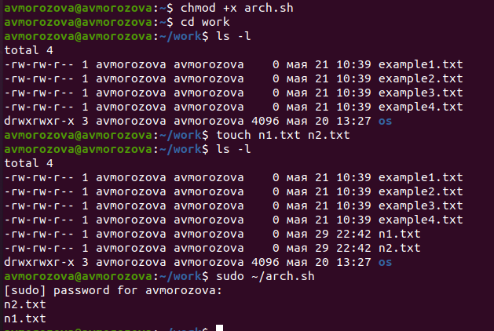

---
## Front matter
lang: ru-RU
title: Лабораторная работа №12
author: |
	Морозова Анастасия Владимировна\inst{1}
institute: |
	\inst{1}RUDN University, Moscow, Russian Federation
date: 28 мая 2021, Москва, Россия

## Formatting
toc: false
slide_level: 2
theme: metropolis
header-includes: 
 - \metroset{progressbar=frametitle,sectionpage=progressbar,numbering=fraction}
 - '\makeatletter'
 - '\beamer@ignorenonframefalse'
 - '\makeatother'
aspectratio: 43
section-titles: true
---

## Цель работы

Изучить основы программирования в оболочке ОС UNIX. Научится писать более сложные командные файлы с использованием логических управляющих конструкций и циклов.

## Выполнение лабораторной работы

1. Создавала файлы, в которых писала скрипты, и открывала их в редакторе emacs (команды «touch *.sh» и «emacs &»).(рис. -@fig:001) 

{ #fig:001 width=70% }

## Выполнение лабораторной работы

2. Пишем скрипты и проверяем работу скриптов.(рис. -@fig:002)

{ #fig:002 width=70% }

## Выполнение лабораторной работы

(рис. -@fig:003)

{ #fig:003 width=70% } 

## Вывод

В ходе выполнения лабораторной работы я изучила основы программирования в оболочке ОС UNIX. Научилась писать более сложные командные файлы с использованием логических управляющих конструкций и циклов.
