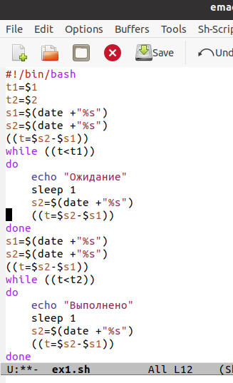
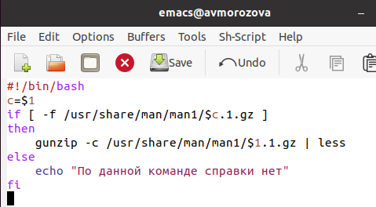
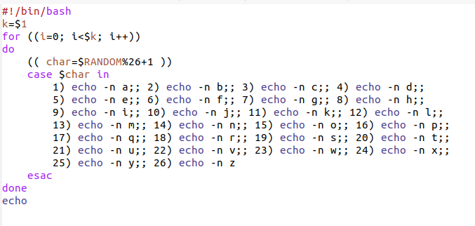

---
## Front matter
lang: ru-RU
title: Лабораторная работа №13
author: |
	Морозова Анастасия Владимировна\inst{1}
institute: |
	\inst{1}RUDN University, Moscow, Russian Federation
date: 5 июня 2021, Москва, Россия

## Formatting
toc: false
slide_level: 2
theme: metropolis
header-includes: 
 - \metroset{progressbar=frametitle,sectionpage=progressbar,numbering=fraction}
 - '\makeatletter'
 - '\beamer@ignorenonframefalse'
 - '\makeatother'
aspectratio: 43
section-titles: true
---

## Цель работы

Изучить основы программирования в оболочке ОС UNIX. Научится писать более сложные командные файлы с использованием логических управляющих конструкций и циклов.

## Задание

1. Ознакомиться с логическими управляющими конструкций и циклов.
2. Написать 3 командных файла в ходе работы.
3. Выполнить отчет.

## Ход работы

Для каждого скрипта создавала файл и открывала в редакторе Emacs. Первый скрипт реализовывал упрощённый механизм семафоров (рис. -@fig:001)

{ #fig:001 width=30% }

## Ход работы

Второй командный файл реализовывал команду man. Предварительно я изучила содержимое каталога /usr/share/man/man1. Задача командного файла: выдавать справку о запрашиваемой команде, либо выводить сообщение об отсутсвии справки (рис. -@fig:002)

{ #fig:002 width=70% }

## Ход работы

В третьем командной файле реализовывалась генерация случайной последовательности букв латинского алфавита, при использовании встроенной переменной $RANDOM (рис. -@fig:003)

{ #fig:003 width=70% }

## Вывод

В ходе выполнения лабораторной работы я изучила основы программирования в оболочке ОС UNIX. Научилась писать более сложные командные файлы с использованием логических управляющих конструкций и циклов.

