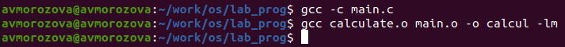
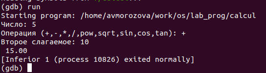
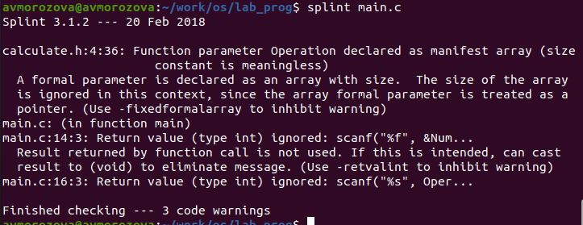

---
## Front matter
lang: ru-RU
title: Лабораторная работа №14
author: |
	Морозова Анастасия Владимировна\inst{1}
institute: |
	\inst{1}RUDN University, Moscow, Russian Federation
date: 5 июня 2021, Москва, Россия

## Formatting
toc: false
slide_level: 2
theme: metropolis
header-includes: 
 - \metroset{progressbar=frametitle,sectionpage=progressbar,numbering=fraction}
 - '\makeatletter'
 - '\beamer@ignorenonframefalse'
 - '\makeatother'
aspectratio: 43
section-titles: true
---

## Цель работы

Приобретение простейших навыков разработки, анализа, тестирования и отладки приложений в ОС типа UNIX/Linux на примере создания на языке программирования С калькулятора с простейшими функциями.

## Задачи

1. Познакомиться со стандартным средством для компиляции программ в ОС типа UNIX - GCC (GNU Compiler Collection). 
2. Познакомиться с отладчиком GDB (GNU Debugger).
3. Познакомиться с утилитой splint.
4. В ходе работы проанализировать и выполнить данные программы.
5. Выполнить отчет.

## Выполнение лабораторной работы

В ходе работы я создавала примитивнейший калькулятор, способный складывать, вычитать, умножать и делить, возводить число в степень, брать квадратный корень, вычислять sin, cos, tan. Для этого создала каталог с тремя файлами: calculate.h, calculate.c, main.c. Выполнила компиляцию программы посредством gcc. (рис. -@fig:001) 

{ #fig:001 width=80% }

## Выполнение лабораторной работы

Создала Makefile. С помощью gdb выполнили отладку программы calcul. (рис. -@fig:002)

{ #fig:002 width=70% }

## Выполнение лабораторной работы

При помощи утилиты splint проанализировала коды файлов calculate.c и main.c. (рис. -@fig:003)

{ #fig:003 width=70% }

## Вывод

В ходе выполнения данной лабораторной работы я приобрела простейшие навыки  разработки, анализа, тестирования и отладки приложений в ОС типа UNIX/Linux на примере создания на языке программирования С калькулятора с простейшими функциями.
