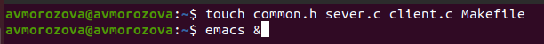
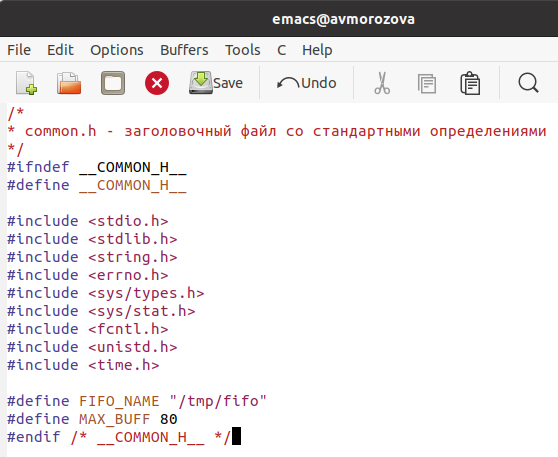
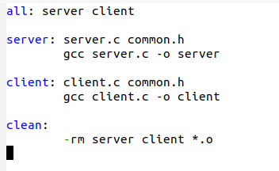
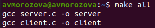
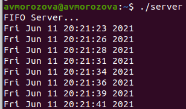

---
## Front matter
lang: ru-RU
title: Лабораторная работа №15
author: |
	Морозова Анастасия Владимировна\inst{1}
institute: |
	\inst{1}RUDN University, Moscow, Russian Federation
date: 11 июня, 2021, Москва, Россия

## Formatting
toc: false
slide_level: 2
theme: metropolis
header-includes: 
 - \metroset{progressbar=frametitle,sectionpage=progressbar,numbering=fraction}
 - '\makeatletter'
 - '\beamer@ignorenonframefalse'
 - '\makeatother'
aspectratio: 43
section-titles: true
---

## Цель работы

 Приобретение практических навыков работы с именованными каналами.
 
## Задание

1. Изучить приведённые в тексте программы server.c и client.c. 
2. Взяв данные примеры за образец, написать аналогичные программы, внеся некоторые изменения

## Выполнение лабораторной работы

1. Создала необходимые файлы (команда touch common.h server.c client.c Makefile), открыла их в редакторе emacs. (рис. -@fig:001) 

{ #fig:001 width=70% }

## Выполнение лабораторной работы

2. Написала коды программ common.h, server.c, client.c, представленных в лабораторной работе, немного изменив их под условия (рис. -@fig:002) 

{ #fig:002 width=50% }

## Выполнение лабораторной работы

3. Написала Makefile (файл для сборки). Оставила его без изменений (рис. -@fig:003)

{ #fig:003 width=70% }

## Выполнение лабораторной работы

4. Скомпилировала файлы (команда make all)(рис. -@fig:004)

{ #fig:004 width=70% }

## Выполнение лабораторной работы

5. Проверила работу написанного кода. (рис. -@fig:005)

{ #fig:005 width=70% }

## Вывод

 Я приобрела практические навыки работы с именованными каналами.
